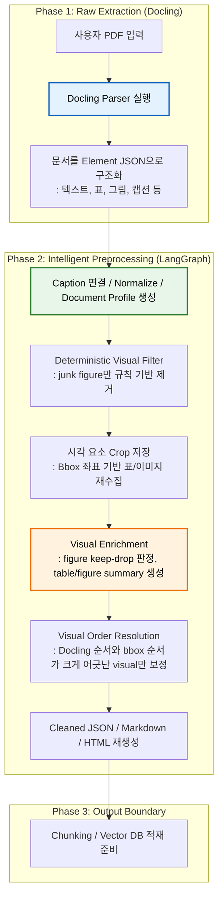

# 📄 Doc-Chat RAG Pipeline

PDF를 단순 문자열로 밀어 넣는 대신, 문서의 구조를 `element 단위 JSON`으로 분해하고 다시 정제해 RAG 친화적인 데이터셋으로 만드는 전처리 파이프라인입니다.

이 프로젝트는 특히 다음 문제를 해결하는 데 초점을 둡니다.

- 표, 그림, 캡션, 헤더/푸터가 섞인 PDF를 구조적으로 분해하기
- 표/그림을 원본 시각 자산까지 보존한 채 후속 RAG에 연결하기
- 필요한 visual만 보강하고, 명백한 visual junk만 보수적으로 제거하기
- 최종적으로 `cleaned.json`, `cleaned.md`, `preview.html`까지 재생성하기

---

## 💡 프로젝트 개요

일반적인 PDF 기반 RAG는 문서를 하나의 긴 Markdown 문자열로 바꾼 뒤 청킹합니다. 이 방식은 구현은 단순하지만, 문서의 실제 구조를 잃어버리는 순간 아래 문제가 생깁니다.

- 표가 본문 사이에 섞이며 의미가 깨짐
- 그림/다이어그램의 시각 정보가 손실됨
- 헤더, 푸터, 페이지 번호, 로고 같은 노이즈가 본문에 섞임
- 후속 chunking에서 문단 경계와 구조 제어가 어려워짐

이 저장소는 문서를 먼저 `element list`로 분해한 뒤, LangGraph 기반 2차 전처리에서 caption 연결, visual crop, figure relevance 판정, table summary 생성을 수행하는 방식을 택합니다. 본문 텍스트는 stage2에서 공격적으로 지우지 않고, 가능한 한 보존한 뒤 이후 chunking 단계에서 검색용 표현으로 재구성하는 방향을 사용합니다.

---

## ✅ 현재 저장소에서 구현된 범위

아래 아키텍처는 최종 목표 기준입니다. 현재 저장소 기준 구현 상태는 다음과 같습니다.

- 구현 완료: `Docling 기반 1차 파싱`, `LangGraph 기반 2차 전처리`, `figure/table crop`, `figure keep/drop 판정`, `table summary text/vlm 라우팅`, `문서 프로파일 추론`, `caption 연결/중복 정리`, `visual bbox 순서 보정`, `Markdown/HTML 재생성`
- 보수적으로 유지: `본문 텍스트는 가능한 한 원형 보존`
- 아직 분리 예정: `OCR Docker 레이어`, `image PDF 자동 라우팅`, `Vector DB 적재/검색 파이프라인`

즉, 현재 저장소는 **입력 PDF를 바로 Docling에 넣을 수 있다는 전제 아래**, `stage1(raw extraction) -> stage2(intelligent preprocessing)` 흐름을 구현하고 있습니다. OCR 라우팅은 아직 이 저장소의 메인 실행 플로우에 포함되어 있지 않습니다.

### 왜 텍스트 정제를 걷어냈는가?

초기에는 짧은 텍스트 semantic keep/drop, 페이지 메타 제거, 본문 조각 attach 같은 텍스트 정제 로직을 stage2에 넣어보려 했습니다. 하지만 실제 문서에 적용해보면 다음 문제가 반복적으로 발생했습니다.

- 문서마다 layout이 달라 같은 규칙이 안정적으로 동작하지 않음
- slide형 문서, 웹 문서, 논문에서 짧은 본문 조각과 핵심 라벨이 자주 false drop 됨
- RAG 관점에서는 false keep보다 false drop이 훨씬 치명적임
- page counter, header/footer, 짧은 메타 줄 같은 요소는 삭제보다 **chunk 조립 시 제외**하는 편이 더 안전함

그래서 현재 stage2는 **lossy text cleaner**가 아니라, **caption/visual 중심의 보수적 구조 정리 단계**로 정리했습니다. 본문 텍스트 품질 개선은 이후 chunking 단계에서 비파괴적으로 처리하는 방향을 택합니다.

---

## 🛠 파이프라인 아키텍처 & 플로우 차트

아래 다이어그램은 **현재 저장소에 실제로 구현된 기준**의 파이프라인입니다. 즉, OCR 단계는 제외하고 `Docling 기반 1차 구조화 -> LangGraph 기반 2차 정제` 흐름만 표현합니다.



### 노드별 설명

| 노드 | 역할 | 현재 저장소 기준 상태 |
| --- | --- | --- |
| A | 사용자가 처리할 PDF를 입력하는 시작 지점 | 구현 전제 |
| B | Docling으로 PDF를 파싱하는 핵심 진입점 | 구현 완료 (`backend/stage1.py`) |
| C | 문서를 heading, paragraph, table, figure, caption 등 `element JSON`으로 평탄화하는 단계 | 구현 완료 |
| D | caption 연결, 기본 텍스트 normalize, `document_profile` 생성 단계 | 구현 완료 |
| E | 명백한 junk figure와 generic `full_page_image`를 제거하는 단계 | 구현 완료 (`rule_filter_elements`) |
| F | figure/table의 bbox를 기준으로 원본 PDF에서 시각 자산을 crop 저장하는 단계 | 구현 완료 (`crop_visuals`) |
| G | figure keep/drop 판정과 table `text/vlm` 라우팅 기반 summary 생성을 수행하는 visual enrichment 단계 | 구현 완료 (`review_single_figure`, `summarize_tables`) |
| H | 같은 페이지의 `figure/table/caption` 중 bbox 순서와 Docling 순서 차이가 큰 visual outlier만 보수적으로 재배치하는 단계 | 구현 완료 (`resolve_visual_order_outliers`) |
| I | 정제된 element를 기준으로 `cleaned.json`, `cleaned.md`, `preview.html`을 재생성하는 단계 | 구현 완료 |
| J | 이후 chunking, embedding, vector DB 적재로 연결되는 출력 경계 | 예정 |

---

## 🔍 현재 코드 기준 실제 처리 흐름

현재 저장소에서 실제로 돌아가는 흐름은 아래 두 단계입니다.

### 1. Stage 1: Docling 기반 Raw Extraction

`backend/stage1.py`가 담당합니다.

- 입력 PDF를 Docling으로 파싱합니다.
- 문서를 `element list`로 평탄화합니다.
- 각 element에 `id`, `category`, `page`, `bbox`, `html`, `caption_refs` 등을 붙입니다.
- table은 Markdown payload를 추가로 저장합니다.
- figure는 picture classification 결과가 있으면 top-k 후보 라벨을 보존합니다.
- 결과를 `backend/outputs/<stem>/<stem>.json`으로 저장합니다.

이 단계의 목표는 문서를 "최종 텍스트"로 만드는 것이 아니라, **후속 판단이 가능한 raw 구조 데이터**를 확보하는 것입니다.

### 2. Stage 2: LangGraph 기반 Intelligent Preprocessing

`backend/stage2.py`와 `backend/stage2_preprocess/*`가 담당합니다.

LangGraph 노드는 아래 순서로 연결됩니다.

1. `load_raw_document`: raw JSON과 source PDF를 읽어 상태 초기화
2. `resolve_captions`: caption ref를 따라 figure/table caption 연결
3. `normalize_elements`: HTML comment / placeholder 제거, 공백 정리, picture top-1 label 보강
4. `infer_document_profile`: 문서 전체 주제와 관련 visual 힌트 추론
5. `rule_filter_elements`: 명백한 junk figure와 generic `full_page_image` 제거
6. `build_visual_tasks`: crop/VLM 대상인 figure, table 작업 목록 생성
7. `crop_visuals`: bbox 기준으로 표/그림 이미지 crop 저장
8. `review_single_figure`: figure별 keep/drop 및 summary 생성
9. `summarize_tables`: table별 `text/vlm` 라우팅 후 핵심 summary 생성
10. `clean_elements`: caption dedupe, table-like figure 중복 제거, visual 결과 반영
11. `resolve_visual_order_outliers`: 같은 페이지의 visual outlier만 bbox 기준으로 보정
12. `render_markdown`: 최종 Markdown 생성
13. `render_preview_html`: 검수용 HTML 생성
14. `write_outputs`: cleaned 산출물 저장

핵심은 **본문 텍스트는 보수적으로 보존하고**, 정말 필요한 visual 판단에만 모델을 개입시키는 점입니다. 즉 stage2의 목적은 텍스트를 많이 삭제하는 것이 아니라, visual 이해를 보강하고 chunking 전 intermediate를 안정적으로 만드는 것입니다.

### visual bbox 순서 보정은 어떻게 동작하는가?

2차 전처리는 기본적으로 Docling이 만든 `order`를 유지합니다. 다만 일부 문서에서는 figure나 table이 실제 페이지 위치보다 훨씬 뒤에 배치되는 경우가 있어, cleaned 결과물에 한해서만 보수적으로 순서를 보정합니다.

- 대상: 같은 페이지의 `figure`, `table`, `caption`
- 기본 원칙: 전역 bbox 정렬은 하지 않고, Docling 순서를 최대한 유지
- 비교 기준:
  - `Docling order rank`
  - `bbox 기준(top, left) rank`
- 보정 조건:
  - 두 rank 차이가 `3 이상`일 때만 outlier로 판단
- 보정 범위:
  - `raw.json`은 그대로 유지
  - `cleaned.json`, `cleaned.md`, `preview.html`에만 반영

즉 bbox는 “순서를 모두 다시 만드는 기준”이 아니라, **Docling 순서가 크게 틀어진 visual만 보조적으로 교정하는 기준**으로 사용합니다.

---

## 🤖 모델 판단 로직

이 프로젝트에서 모델은 "문서 전체를 다시 쓰는 생성기"가 아니라, **규칙만으로는 애매한 지점만 보조 판단하는 심사기** 역할을 맡습니다.

### 1. `document_profile`은 어떻게 만드는가?

`document_profile`은 figure keep/drop 판단의 기준축이 되는 문서 전역 컨텍스트입니다. [`backend/stage2_preprocess/nodes.py`](/Users/sonseog-u/DEV/01-projects/rag_chat/backend/stage2_preprocess/nodes.py) 의 `infer_document_profile` 노드에서 생성합니다.

생성 방식은 다음과 같습니다.

- 먼저 문서 앞부분의 `heading`과 본문 샘플을 수집합니다.
- 이때 figure, table, caption, header/footer 같은 요소는 제외합니다.
- 수집한 heading 후보와 본문 snippet을 구조화 출력 모델에 넣어 문서의 주제와 시각자료 relevance 힌트를 추론합니다.
- 이 단계는 VLM이 아니라 **저가 텍스트 모델**로 수행해 비용을 줄입니다.

현재 스키마는 아래 필드를 갖습니다.

- `title`: 문서 대표 제목
- `document_type`: 기술 문서, 강의 자료, 논문 같은 문서 유형
- `main_topics`: 문서 핵심 주제 키워드
- `relevant_visual_types`: 이 문서에서 유의미할 가능성이 높은 visual 유형
- `irrelevant_visual_hints`: 광고, 배너, 장식 이미지처럼 무관할 가능성이 높은 visual 힌트

즉 `document_profile`은 "이 문서는 대체 무엇에 대한 문서인가?"를 먼저 압축해두고, 이후 figure/table 판단에서 그 문맥을 계속 재사용하기 위한 장치입니다. 실제 프롬프트에는 pretty JSON 전체를 반복해서 넣지 않고, 제목 / 문서 유형 / 핵심 토픽 / 관련 visual 힌트만 **짧은 문자열로 압축한 형태**로 재사용합니다.

`document_profile`은 이전 텍스트 keep/drop 실험에서도 함께 사용했지만, 현재는 텍스트 정제를 위한 신호가 아니라 **figure/table relevance 판단을 위한 문서 전역 컨텍스트**로만 사용합니다.

### 2. figure의 keep / drop은 어떻게 결정하는가?

figure는 두 단계로 걸러집니다.

#### 2-1. 규칙 기반 1차 필터

`rule_filter_elements`에서 아래처럼 **명백한 visual junk**는 모델 호출 전에 제거합니다.

- picture classification 결과가 `logo`, `icon`, `qr_code`, `bar_code`, `page_thumbnail`로 강하게 잡힌 figure
- top-1 label이 `full_page_image`이면서 아래 조건을 동시에 만족하는 generic 페이지 통이미지
  - confidence `>= 0.6`
  - caption 없음
  - `text`가 `Full page image` 같은 generic 값
  - bbox가 페이지 대부분을 차지함

이 규칙을 둔 이유는, 웹 크롤링 PDF나 e북 계열 문서에서 `full_page_image`가 실제 본문 도표보다 **광고성 전체 스크린샷, 웹 UI 통이미지, 문맥과 무관한 페이지 캡처**로 잡히는 경우가 훨씬 많았기 때문입니다. 즉 이 규칙은 일반 PDF 전체를 공격적으로 자르기 위한 것이 아니라, **웹 문서 계열에서 반복적으로 들어오는 불필요한 통이미지 비용을 먼저 줄이기 위한 보수적 필터**입니다.

즉, 쉽게 버릴 수 있는 것은 먼저 버리고 모델 호출 비용을 줄입니다.

#### 2-2. VLM 기반 2차 판단

남은 figure는 `review_single_figure`에서 개별적으로 검토합니다. 이때 모델 입력은 단순 이미지 하나가 아니라 아래 정보를 함께 받습니다.

- `document_profile` `compact prompt form`
- 연결된 caption
- 실제 crop 이미지
- 같은 페이지에서 figure 앞/뒤로 가장 가까운 본문 텍스트 1개씩 `optional`

모델은 구조화 스키마로 아래 값을 반환합니다.

- `action`: `keep` 또는 `drop`
- `summary`: `keep`일 때만 생성되는 1~3문장 한국어 요약

판단 기준은 매우 보수적으로 잡혀 있습니다.

- 본문 이해에 직접 도움이 되면 `keep`
- 장식, 광고, 로고, 아이콘, 문맥과 무관한 홍보성 visual이면 `drop`
- summary에는 실제로 이미지 안에서 식별 가능한 텍스트만 반영
- 보이지 않는 텍스트나 의미는 추측하지 않음

여기서 local body context는 현재 figure 주변의 **보조 힌트**로만 사용됩니다.

- 같은 페이지에서 앞/뒤를 각각 탐색합니다.
- `caption`, `figure`, `table`, `page_header`, `page_footer`는 건너뜁니다.
- `heading`을 만나면 그 방향 탐색을 종료합니다.
- `paragraph`, `list`에 해당하는 본문 텍스트만 한 개씩 채택합니다.

즉, 같은 "스크린샷"이어도 문서가 제품 매뉴얼이면 `keep`될 수 있고, unrelated 배너 이미지면 `drop`될 수 있습니다. 이 차이를 만드는 기준은 **`document_profile + caption + image + optional local body context`** 입니다.

### 3. table summary는 어떻게 만드는가?

table은 `summarize_tables` 노드에서 처리합니다. figure처럼 keep/drop을 하지 않고, **검색에 도움이 되는 짧은 요약**을 만드는 쪽에 집중합니다. 다만 현재는 모든 table을 곧바로 VLM에 보내지 않고, **HTML만으로 충분한 표는 텍스트 모델로 처리하고 부족한 표만 VLM으로 보내는 라우팅 구조**를 사용합니다.

#### 3-1. 1차 라우팅: HTML만으로 충분한가?

먼저 아래 입력으로 `text` 또는 `vlm`을 결정합니다.

- `document_profile` `compact prompt form`
- table caption
- compact된 `table html`

라우팅 스키마는 매우 단순합니다.

- `text`: HTML만으로 요약 가능
- `vlm`: 이미지까지 봐야 요약 가능

이렇게 두는 이유는, 구조가 충분한 표까지 전부 이미지 VLM으로 보내면 비용이 크기 때문입니다.

#### 3-2. `text` 경로

라우팅 결과가 `text`이면, 저가 텍스트 모델이 아래 정보를 바탕으로 summary를 생성합니다.

- `document_profile`
- table caption
- compact된 `table html`

즉 구조가 잘 살아 있는 표는 이미지 없이도 처리합니다.

#### 3-3. `vlm` 경로

라우팅 결과가 `vlm`이면, 그때만 기존처럼 이미지 기반 summary를 생성합니다.

- `document_profile`
- table caption
- 원본 table crop 이미지
- 같은 페이지에서 앞/뒤로 가장 가까운 본문 텍스트 1개씩 `optional`

프롬프트도 복원 중심이 아니라 요약 중심으로 설계돼 있습니다.

- 표를 완벽한 구조로 다시 쓰라고 하지 않음
- 검색에 도움이 되는 핵심 정보만 1~3문장으로 요약
- 표 제목, 주요 수치, 비교 축, 분류 기준 같은 핵심만 남김

즉 이 summary는 "표를 다시 그리는 것"이 아니라, **retrieval 단계에서 표가 어떤 내용을 담고 있는지 빠르게 검색되게 만드는 설명 메타데이터**에 가깝습니다.

### 4. 텍스트는 현재 어떻게 다루는가?

현재 stage2는 본문 텍스트를 공격적으로 제거하지 않습니다.

- `paragraph`, `heading`, `list`, `code`, `footnote`는 기본적으로 유지합니다.
- heading 승격, page counter 제거, 짧은 텍스트 keep/drop, attach 같은 로직은 현재 제거했습니다.
- `normalize_elements`는 텍스트 의미를 바꾸지 않고, HTML comment / placeholder 제거와 공백 정리 정도만 수행합니다.
- `caption`은 예외적으로 visual에 이미 연결된 경우에만 별도 element에서 중복 제거됩니다.

즉 현재 `cleaned.json`은 텍스트를 깎아낸 결과물이라기보다, **caption 연결과 visual 보강이 반영된 intermediate representation**에 가깝습니다.

### 5. summary는 최종 문서에 어떻게 반영되는가?

정제 단계가 끝나면 summary는 cleaned 결과물에 반영됩니다.

- figure는 `visual_summary`
- table은 `table_summary`

이 값들은 이후:

- `cleaned.json`의 구조화 필드로 남고
- `cleaned.md`에는 본문에 함께 렌더링되며
- `preview.html`에서도 사람이 검수할 수 있게 표시됩니다.

그래서 최종 산출물은 단순 텍스트 추출 결과가 아니라, **시각 자료에 대한 추가 검색 단서가 보강된 문서 표현**이 됩니다.

### 6. 모델 실패 시에는 어떻게 처리하는가?

현재 구현은 데이터 손실을 줄이는 쪽으로 fallback을 둡니다.

- figure review 실패 시: caption 또는 picture top-1 label 기반 최소 summary로 대체하고, 기본적으로 `keep` 쪽으로 복구
- 단, `full_page_image`가 generic page image 조건에 해당하면 fallback에서도 다시 `drop`으로 처리해 웹 스크린샷성 정크가 살아남지 않게 합니다
- table summary 실패 시: caption 또는 table 텍스트 일부를 이용해 최소 summary 생성

즉 모델이 실패하더라도 파이프라인 전체가 멈추거나 visual 정보가 통째로 사라지지 않도록 설계돼 있습니다.

### 7. 비용 문제는 어떻게 줄였는가?

초기 버전은 figure/table/문서 프로파일이 모두 같은 고비용 경로를 타기 쉬워 토큰 사용량이 커질 수 있었습니다. 현재는 아래 방식으로 비용을 줄이는 방향으로 정리했습니다.

- 텍스트 작업과 이미지 작업의 모델을 분리
  - `OPENAI_VLM_MODEL`: figure VLM 판단, VLM table summary
  - `OPENAI_TEXT_MODEL`: document profile, table text summary
- `infer_document_profile`를 VLM이 아니라 저가 텍스트 모델로 수행
- `document_profile`을 pretty JSON이 아니라 compact 문자열로 압축해 반복 입력 토큰 감소
- table은 전부 이미지로 보내지 않고, 먼저 `html -> text/vlm` 라우팅으로 분기
- generic `full_page_image`는 규칙 기반으로 먼저 제거해 불필요한 figure VLM 호출을 줄임

또한 LangSmith tracing으로 실제 호출 비용을 확인해, 현재 병목이 table/text 쪽이 아니라 **figure VLM 이미지 호출**이라는 점을 검증했습니다. 즉 현재 최적화 방향은 감이 아니라 trace 기준으로 조정하고 있습니다.

즉 현재 최적화 방향은 **"이미지를 꼭 봐야 하는 곳만 VLM, 나머지는 저가 텍스트 모델"** 입니다.

---

## 🧠 설계 철학

### 1. 왜 곧바로 Markdown으로 쓰지 않고 `JSON Element List`로 강제 분해하는가?

긴 Markdown 문자열 하나로 바꾸면 구조 복구가 거의 불가능해집니다. 반대로 문서를 `heading`, `paragraph`, `table`, `figure`, `caption` 같은 최소 단위로 보존하면 후속 단계에서 훨씬 안정적으로 제어할 수 있습니다.

- junk 요소를 규칙 기반으로 제거하기 쉽습니다.
- chunking 전에 문단 경계와 구조를 정밀하게 다룰 수 있습니다.
- page, bbox, caption ref 같은 메타데이터를 잃지 않습니다.
- visual/text를 별도 정책으로 처리할 수 있습니다.

여기서 중요한 점은, 현재는 "전처리에서 본문을 정리해서 완성한다"기보다 "후속 chunking이 활용할 수 있도록 intermediate를 잃지 않고 보존한다"에 더 가깝다는 것입니다.

### 2. 왜 figure와 table을 원본 PDF에서 다시 crop하는가?

표와 다이어그램은 텍스트로만 변환하면 원본 맥락이 깨집니다. 이 프로젝트는 bbox 좌표를 이용해 원본 PDF에서 다시 잘라 저장함으로써 원본 시각 정보를 보존합니다.

- VLM이 원본 이미지를 직접 보고 요약할 수 있습니다.
- RAG 응답 시 원본 표/그림을 근거 자료로 다시 보여줄 수 있습니다.
- Markdown 변환이 깨져도 원본 visual이 백업 데이터 역할을 합니다.

### 3. 왜 2차 전처리에 LangGraph를 쓰는가?

문서 전처리는 단순 직렬 스크립트보다 예외 케이스가 훨씬 많습니다. 반대로 모든 결정을 일반 에이전트에게 맡기면 데이터 파손 위험이 커집니다.

LangGraph를 쓰는 이유는 다음과 같습니다.

- 단계별 상태를 명확하게 유지할 수 있습니다.
- 규칙 기반 처리와 모델 기반 처리를 섞어 쓸 수 있습니다.
- figure review처럼 fan-out 작업을 노드 단위로 분리할 수 있습니다.
- 추후 OCR 라우팅, human review, chunking 분기까지 자연스럽게 확장할 수 있습니다.

---

## 📂 프로젝트 구조

```text
backend/
├── stage1.py                  # Docling 기반 raw element JSON 생성
├── stage2.py                  # Stage-2 LangGraph 엔트리포인트
├── stage2_preprocess/
│   ├── graph.py               # 그래프 연결 및 라우팅
│   ├── nodes.py               # 전처리 노드 구현
│   ├── state.py               # 공유 상태 / structured output schema
│   ├── utils.py               # bbox, 렌더링, 휴리스틱 유틸
│   └── llm.py                 # 모델 로딩 및 기본 경로 설정
└── outputs/                   # 문서별 산출물 저장
```

---

## 📦 산출물 구조

문서 하나를 처리하면 보통 아래 구조가 생성됩니다.

```text
backend/outputs/<document_stem>/
├── <document_stem>.pdf
├── <document_stem>.json
├── cleaned.json
├── cleaned.md
├── preview.html
├── figures/
└── tables/
```

### 파일별 의미

- `<stem>.json`: Stage-1 raw element list
- `cleaned.json`: Stage-2 후처리 반영 결과
- `cleaned.md`: 사람/LLM이 읽기 쉬운 최종 Markdown
- `preview.html`: 검수용 렌더링 결과
- `figures/`, `tables/`: 원본 PDF에서 crop한 visual asset

### `cleaned.json`에 추가로 남는 메타데이터

Stage-2 순서 보정이 켜진 이후 `cleaned.json`에는 아래 메타가 함께 남습니다.

- `ordering_resolution`
  - `applied`: bbox 보정이 실제로 적용됐는지 여부
  - `adjusted_ids`: 재배치된 element id 목록
  - `rank_gap_threshold`: outlier 판단에 사용한 rank 차이 기준
- 각 element별:
  - `order`: Docling 원래 순서
  - `resolved_order`: Stage-2에서 확정된 최종 순서

즉 `raw.json`은 원본 기준, `cleaned.json`은 후처리 기준의 단일 source of truth로 유지됩니다.

### `cleaned.json`은 어떤 방향으로 슬림하게 유지하는가?

`cleaned.json`은 단순 디버그 덤프가 아니라, 이후 chunking / embedding으로 넘기기 쉬운 **후처리 기준 intermediate**로 유지하는 것을 목표로 합니다. 따라서 현재는 텍스트 노이즈를 전부 지우기보다, 본문과 visual 메타데이터를 가능한 한 보존하는 방향을 택합니다.

그래서 export 시점에는 아래처럼 내부 처리용 필드는 제외합니다.

- `docling_ref`
- `coord_origin`
- `internal_caption_text`
- `primary_picture_label`
- `primary_picture_confidence`

즉 `cleaned.json`에는 최종 후속 단계가 실제로 사용할 구조, 캡션, 요약, crop 상대경로, 정렬 결과만 남기고, 내부 추적용 정보는 가능한 한 덜어내는 방향으로 관리합니다.

---

## 🚀 실행 방법

현재 버전은 연구/프로토타입 형태라 일부 입력 경로가 코드 상수로 설정되어 있습니다.

### 1. 환경 준비

```bash
python -m venv .venv
source .venv/bin/activate
pip install -r requirements.txt
```

`.env`에는 최소한 아래 값이 필요합니다.

```bash
OPENAI_API_KEY=...
OPENAI_VLM_MODEL=openai:gpt-4o-mini
OPENAI_TEXT_MODEL=openai:gpt-4.1-nano
LANGSMITH_TRACING=true
LANGSMITH_API_KEY=...
LANGSMITH_PROJECT=rag-chat-stage2
LANGCHAIN_CALLBACKS_BACKGROUND=false
```

LangGraph/LangChain 기반 호출은 LangSmith tracing이 자동으로 잡힙니다. 현재 프로젝트는 `.env`에 위 값을 넣으면 별도 코드 수정 없이 stage2의 모델 호출이 LangSmith에 기록됩니다.

### 2. Stage 1 실행

현재는 [`backend/stage1.py`](/Users/sonseog-u/DEV/01-projects/rag_chat/backend/stage1.py) 내부의 `INPUT_PDF_PATH`를 원하는 PDF 경로로 바꾼 뒤 실행합니다.

```bash
python -m backend.stage1
```

실행 후 `backend/outputs/<stem>/<stem>.json`이 생성됩니다.

### 3. Stage 2 실행

현재는 [`backend/stage2_preprocess/llm.py`](/Users/sonseog-u/DEV/01-projects/rag_chat/backend/stage2_preprocess/llm.py) 내부의 `DEFAULT_RAW_JSON_PATH`가 기본 입력입니다.

```bash
python -m backend.stage2
```

실행 후 `cleaned.json`, `cleaned.md`, `preview.html`, crop 이미지가 생성됩니다.

---

## 🧪 현재 구현 포인트 요약

- `stage1`은 **raw extraction 전용**입니다.
- `stage2`는 **정제, visual 판단, 렌더링 전용**입니다.
- 다만 현재 `stage2`의 정제는 **text filtering**보다 **caption/visual 중심의 보수적 정리**에 가깝습니다.
- `stage2` 코드는 `backend/stage2_preprocess/` 패키지로 분리해 `state / llm / utils / nodes / graph` 구조로 정리했습니다.
- figure는 VLM으로 `keep/drop + summary`를 생성합니다.
- 다만 generic `full_page_image`는 규칙 기반으로 먼저 제거하고, figure review가 실패하더라도 같은 조건이면 fallback `keep`으로 살리지 않습니다.
- table은 `document_profile + caption + compact html`로 먼저 `text/vlm`을 라우팅하고, `text`면 저가 텍스트 모델, `vlm`이면 이미지 모델로 summary를 생성합니다.
- `document_profile`은 저가 텍스트 모델로 먼저 만들고, 이후 prompt에는 compact 문자열로 재사용합니다.
- figure relevance 판단은 문서 전체 주제, caption, 이미지, 주변 본문 텍스트를 함께 참고합니다.
- 텍스트 keep/drop, page counter 제거, heading 승격 같은 공격적 텍스트 정제는 현재 제거했습니다.
- 현재 page chrome 성격의 텍스트는 stage2에서 삭제하지 않고, 이후 chunking 단계에서 비파괴적으로 다룰 계획입니다.
- 구조화 출력은 필요한 필드만 남기도록 단순화했습니다.
  - figure: `action`, `summary`
  - table: `summary`
  - table route: `route`
  - document profile: `title`, `document_type`, `main_topics`, `relevant_visual_types`, `irrelevant_visual_hints`
- 구조화 출력 노드는 별도 `SystemMessage` 없이 `with_structured_output(...) + HumanMessage prompt` 조합으로 동작합니다.
- caption 연결, table-like figure 제거, visual bbox 순서 보정, preview HTML 생성까지 포함합니다.

### visual 입력 디버그 스크립트

실제 figure/table 모델 입력이 어떻게 조립되는지 확인하기 위해 [`backend/debug_visual_inputs.py`](/Users/sonseog-u/DEV/01-projects/rag_chat/backend/debug_visual_inputs.py) 를 함께 둡니다.

- raw.json 기준으로 Stage-2의 결정론적 단계만 다시 수행
- figure/table마다 아래 값을 재구성
  - `document_profile`
  - `caption`
  - `image_path`
  - `prev_body_text`
  - `next_body_text`
- 현재 figure 입력 흐름과 table summary 보조 문맥 구성을 사람이 검토하기 쉽게 출력
- 출력 파일
  - `debug_visual_inputs.json`
  - `debug_visual_inputs.txt`

예시:

```bash
.venv/bin/python backend/debug_visual_inputs.py --raw-json backend/outputs/1/1.json --kind all --limit 10
```

`debug_visual_inputs.txt`는 사람이 한눈에 볼 수 있게 `HumanMessage(content=[...])` 느낌으로 prompt와 이미지 경로를 함께 풀어쓴 디버그 출력입니다.

---

## 🗺️ 로드맵

- [ ] OCR Docker 레이어와 현재 파이프라인 통합
- [ ] PDF 유형 자동 판정 및 OCR 분기 라우팅 구현
- [ ] chunking 정책과 Vector DB 적재 단계 연결
- [ ] CLI 인자 기반 실행으로 `INPUT_PDF_PATH` / `DEFAULT_RAW_JSON_PATH` 상수 제거
- [ ] visual enrichment 품질 평가 및 human review 루프 추가
