# 📄 Doc-Chat RAG Pipeline

PDF를 단순 문자열로 밀어 넣는 대신, 문서의 구조를 `element 단위 JSON`으로 분해하고 다시 정제해 RAG 친화적인 데이터셋으로 만드는 전처리 파이프라인입니다.

이 프로젝트는 특히 다음 문제를 해결하는 데 초점을 둡니다.

- 표, 그림, 캡션, 헤더/푸터가 섞인 PDF를 구조적으로 분해하기
- 표/그림을 원본 시각 자산까지 보존한 채 후속 RAG에 연결하기
- 필요한 visual만 보강하고, 명백한 visual junk만 보수적으로 제거하기
- 최종적으로 `cleaned.json`, `cleaned.md`, `preview.html`, `reviewed_cleaned.json`, `chunks.json`, `chunks.jsonl`, `chunks.md`, `indexing.json`까지 재생성하기

---

## 💡 프로젝트 개요

일반적인 PDF 기반 RAG는 문서를 하나의 긴 Markdown 문자열로 바꾼 뒤 청킹합니다. 이 방식은 구현은 단순하지만, 문서의 실제 구조를 잃어버리는 순간 아래 문제가 생깁니다.

- 표가 본문 사이에 섞이며 의미가 깨짐
- 그림/다이어그램의 시각 정보가 손실됨
- 헤더, 푸터, 페이지 번호, 로고 같은 노이즈가 본문에 섞임
- 후속 chunking에서 문단 경계와 구조 제어가 어려워짐

이 저장소는 문서를 먼저 `element list`로 분해한 뒤, LangGraph 기반 2차 전처리에서 caption 연결, visual crop, figure relevance 판정, table summary 생성을 수행하는 방식을 택합니다. 본문 텍스트는 stage2에서 공격적으로 지우지 않고, 가능한 한 보존한 뒤 이후 chunking 단계에서 검색용 표현으로 재구성하는 방향을 사용합니다.

---

## ✅ 현재 저장소에서 구현된 범위

아래 아키텍처는 최종 목표 기준입니다. 현재 저장소 기준 구현 상태는 다음과 같습니다.

- 구현 완료: `Docling 기반 1차 파싱`, `LangGraph 기반 2차 전처리`, `figure/table crop`, `figure fan-out review`, `figure keep/drop 판정`, `table summary prepare-route-text/vlm 분기`, `문서 프로파일 추론`, `caption 연결/중복 정리`, `visual bbox 순서 보정`, `Markdown/HTML 재생성`, `stage3 구조 기반 chunking`, `부모 그룹(parent) 생성`, `chunk preview Markdown 생성`, `dense embedding 생성`, `Qdrant hybrid(dense+BM25) upsert`, `stage4 query embedding`, `dense / hybrid retrieval`, `retrieval eval 세트 및 채점 스크립트`, `문서 단위 저장소(document store)`, `FastAPI 기반 업로드/실행 API`, `stage2 review overlay`, `React/Vite 검수 UI MVP`
- 보수적으로 유지: `본문 텍스트는 가능한 한 원형 보존`
- 아직 분리 예정: `OCR Docker 레이어`, `image PDF 자동 라우팅`, `reranking`, `chat serving layer`

즉, 현재 저장소는 **입력 PDF를 바로 Docling에 넣을 수 있다는 전제 아래**, `stage1(raw extraction) -> stage2(intelligent preprocessing) -> review overlay(optional) -> stage3(chunking + indexing) -> stage4(retrieval + evaluation)` 흐름을 구현하고 있습니다. 현재 운영 기본값은 `dense retrieval`이며, `hybrid retrieval`은 동일 컬렉션에서 on/off 가능한 실험 옵션으로 유지합니다. OCR 라우팅, reranking, chat serving은 아직 메인 실행 플로우에 포함되어 있지 않습니다.

### 현재 로컬 웹앱 진행 상태

현재는 CLI만 있는 상태가 아니라, **로컬 웹앱으로 문서 업로드 -> stage 실행 -> stage2 검수 -> stage3 진행**까지 이어지는 최소 작업 흐름을 이미 붙여 둔 상태입니다.

- 백엔드: FastAPI
- 프론트: React + Vite + TypeScript
- 저장 구조: 문서마다 `backend/outputs/<document_id>/...`
- 검수 방식: `cleaned.json`을 직접 수정하지 않고 `review_decisions.json` overlay를 저장한 뒤 `reviewed_cleaned.json`을 재생성

즉 현재 기본 진입점은 아래 두 가지입니다.

- 연구/디버그용: 기존 `python -m backend.stage1`, `stage2`, `stage3`, `stage4`
- 서비스형 로컬 워크플로우용: `uvicorn backend.api.main:app --reload` + `frontend` 개발 서버

이 구조를 택한 이유는 다음과 같습니다.

- stage별 책임은 그대로 유지하면서도, 프론트에서는 문서 단위 API만 호출하면 되기 때문
- stage2 자동 결과를 사람이 빠르게 보정한 뒤 stage3로 넘길 수 있기 때문
- 추후 Tauri로 감싸더라도, 내부 처리 엔진은 그대로 재사용할 수 있기 때문

### 문서 단위 저장 구조

현재 API 경로도 기존 stage 산출물과 같은 루트인 `backend/outputs/` 아래를 사용합니다. 다만 프론트/API 경유 문서는 숫자 폴더 대신 `document_id` 기준 하위 폴더를 씁니다.

```text
backend/outputs/<document_id>/
├── source/
│   ├── original.pdf
│   └── document.json
├── stage1/
│   └── raw.json
├── stage2/
│   ├── cleaned.json
│   ├── cleaned.md
│   └── preview.html
├── review/
│   ├── review_decisions.json
│   ├── reviewed_cleaned.json
│   ├── reviewed_cleaned.md
│   └── reviewed_preview.html
├── stage3/
│   ├── chunks.json
│   ├── chunks.jsonl
│   ├── chunks.md
│   ├── parents.json
│   └── indexing.json
└── stage4/
    └── retrieval.json
```

이때 핵심 원칙은 아래와 같습니다.

- `stage2/cleaned.json`은 자동 전처리 결과를 보존합니다.
- 사람이 수정한 내용은 `review/review_decisions.json`에만 저장합니다.
- 실제 chunking/indexing은 `reviewed_cleaned.json`이 있으면 그것을 우선 사용합니다.

### 왜 텍스트 정제를 걷어냈는가?

초기에는 짧은 텍스트 semantic keep/drop, 페이지 메타 제거, 본문 조각 attach 같은 텍스트 정제 로직을 stage2에 넣어보려 했습니다. 하지만 실제 문서에 적용해보면 다음 문제가 반복적으로 발생했습니다.

- 문서마다 layout이 달라 같은 규칙이 안정적으로 동작하지 않음
- slide형 문서, 웹 문서, 논문에서 짧은 본문 조각과 핵심 라벨이 자주 false drop 됨
- RAG 관점에서는 false keep보다 false drop이 훨씬 치명적임
- page counter, header/footer, 짧은 메타 줄 같은 요소는 삭제보다 **chunk 조립 시 제외**하는 편이 더 안전함

그래서 현재 stage2는 **lossy text cleaner**가 아니라, **caption/visual 중심의 보수적 구조 정리 단계**로 정리했습니다. 본문 텍스트 품질 개선은 이후 chunking 단계에서 비파괴적으로 처리하는 방향을 택합니다.

---

## 🛠 파이프라인 아키텍처 & 플로우 차트

아래 다이어그램은 **현재 저장소에 실제로 구현된 기준**의 파이프라인입니다. 즉, OCR 단계는 제외하고 `Docling 기반 1차 구조화 -> LangGraph 기반 2차 정제` 흐름만 표현합니다.

```mermaid
flowchart TD
    subgraph "Phase 1: Raw Extraction (Docling)"
        A[사용자 PDF 입력] --> B[Docling Parser 실행]
        B --> C[문서를 Element JSON으로 구조화\n: 텍스트, 표, 그림, 캡션 등]
    end

    subgraph "Phase 2: Intelligent Preprocessing (LangGraph)"
        C --> D[Caption 연결 / Normalize / Document Profile 생성]
        D --> E[Deterministic Visual Filter\n: junk figure만 규칙 기반 제거]
        E --> F[시각 요소 Crop 저장\n: Bbox 좌표 기반 표/이미지 재수집]
        F --> G[Visual Enrichment\n: figure keep-drop 판정, table/figure summary 생성]
        G --> H[Visual Order Resolution\n: Docling 순서와 bbox 순서가 크게 어긋난 visual만 보정]
        H --> I[Cleaned JSON / Markdown / HTML 재생성]
    end

    subgraph "Phase 3: Chunking + Indexing"
        I --> J[Heading Path 기반 구조 청킹]
        J --> K[긴 prose hard split / parent grouping\n: split된 prose에만 overlap]
        K --> L[chunks.json / chunks.jsonl / chunks.md / parents.json 생성]
        L --> M[Dense Embedding 생성 + BM25 sparse slot 구성\n: Qdrant hybrid collection upsert]
    end

    subgraph "Phase 4: Retrieval"
        M --> N[질의 Embedding 생성]
        N --> O[Dense Retrieval 기본\nHybrid Retrieval 실험 옵션]
        O --> P[retrieval.json optional 기록\n및 eval report 생성]
    end

    style B fill:#e3f2fd,stroke:#1565c0,stroke-width:2px,color:#000
    style D fill:#e8f5e9,stroke:#2e7d32,stroke-width:2px,color:#000
    style G fill:#fff3e0,stroke:#ef6c00,stroke-width:2px,color:#000
    style J fill:#f3e5f5,stroke:#6a1b9a,stroke-width:2px,color:#000
    style M fill:#ede7f6,stroke:#4527a0,stroke-width:2px,color:#000
    style O fill:#fff8e1,stroke:#f9a825,stroke-width:2px,color:#000
```



### 노드별 설명

| 노드 | 역할 | 현재 저장소 기준 상태 |
| --- | --- | --- |
| A | 사용자가 처리할 PDF를 입력하는 시작 지점 | 구현 전제 |
| B | Docling으로 PDF를 파싱하는 핵심 진입점 | 구현 완료 (`backend/stage1.py`) |
| C | 문서를 heading, paragraph, table, figure, caption 등 `element JSON`으로 평탄화하는 단계 | 구현 완료 |
| D | caption 연결, 기본 텍스트 normalize, `document_profile` 생성 단계 | 구현 완료 |
| E | 명백한 junk figure와 generic `full_page_image`를 제거하는 단계 | 구현 완료 (`rule_filter_elements`) |
| F | figure/table의 bbox를 기준으로 원본 PDF에서 시각 자산을 crop 저장하는 단계 | 구현 완료 (`crop_visuals`) |
| G | figure review와 table `prepare -> route -> text/vlm summary`를 수행하는 visual enrichment 단계 | 구현 완료 (`build_figure_review_requests`, `review_single_figure`, `prepare_table_summary_inputs`, `route_table_summaries`, `summarize_tables_text`, `summarize_tables_vlm`) |
| H | 같은 페이지의 `figure/table/caption` 중 bbox 순서와 Docling 순서 차이가 큰 visual outlier만 보수적으로 재배치하는 단계 | 구현 완료 (`resolve_visual_order_outliers`) |
| I | 정제된 element를 기준으로 `cleaned.json`, `cleaned.md`, `preview.html`을 재생성하는 단계 | 구현 완료 |
| J | `cleaned.json`을 기준으로 heading path를 유지한 text / table / figure chunk 초안을 만드는 단계 | 구현 완료 (`backend/stage3_chunking/`) |
| K | 같은 `heading_path` 아래 prose run을 유지하면서, 너무 긴 본문만 hard split 하고 parent 그룹을 만드는 단계 | 구현 완료 |
| L | `chunks.json`, `chunks.jsonl`, `chunks.md`, `parents.json`을 저장하는 단계 | 구현 완료 |
| M | 같은 embedding 모델로 dense vector를 만들고, 같은 컬렉션에 BM25 sparse slot까지 함께 올리는 단계 | 구현 완료 (`backend/stage3_indexing/`) |
| N | 사용자 질의를 같은 embedding 공간으로 변환하는 단계 | 구현 완료 (`backend/stage4_retrieval/`) |
| O | dense 검색 기본 운영, hybrid 검색 실험 옵션, 문서 필터 적용, parent lookup 결합 단계 | 구현 완료 |
| P | retrieval manifest optional 저장 및 평가 리포트 생성 단계 | 구현 완료 (`backend/stage4_eval.py`, `backend/stage4_retrieval/evaluation.py`) |

---

## 🔍 현재 코드 기준 실제 처리 흐름

현재 저장소에서 실제로 돌아가는 흐름은 아래 네 단계입니다.

### 1. Stage 1: Docling 기반 Raw Extraction

`backend/stage1.py`가 담당합니다.

- 입력 PDF를 Docling으로 파싱합니다.
- 문서를 `element list`로 평탄화합니다.
- 각 element에 `id`, `category`, `page`, `bbox`, `html`, `caption_refs` 등을 붙입니다.
- table은 Markdown payload를 추가로 저장합니다.
- figure는 picture classification 결과가 있으면 top-k 후보 라벨을 보존합니다.
- 결과를 `backend/outputs/<document_id>/stage1/raw.json`으로 저장합니다.

이 단계의 목표는 문서를 "최종 텍스트"로 만드는 것이 아니라, **후속 판단이 가능한 raw 구조 데이터**를 확보하는 것입니다.

### 2. Stage 2: LangGraph 기반 Intelligent Preprocessing

`backend/stage2.py`와 `backend/stage2_preprocess/*`가 담당합니다.

LangGraph 노드는 아래 순서로 연결됩니다.

1. `load_raw_document`: raw JSON과 source PDF를 읽어 상태 초기화
2. `resolve_captions`: caption ref를 따라 figure/table caption 연결
3. `normalize_elements`: HTML comment / placeholder 제거, 공백 정리, picture top-1 label 보강
4. `infer_document_profile`: 문서 전체 주제와 관련 visual 힌트 추론
5. `rule_filter_elements`: 명백한 junk figure와 generic `full_page_image` 제거
6. `build_visual_tasks`: crop/VLM 대상인 figure, table 작업 목록 생성
7. `crop_visuals`: bbox 기준으로 표/그림 이미지 crop 저장
8. `build_figure_review_requests`: figure별 review 입력을 구성해 상태에 적재
9. `route_figure_reviews`: figure review를 `Send` fan-out으로 분기하거나, figure가 없으면 table 단계로 바로 이동
10. `review_single_figure`: figure별 keep/drop 및 summary 생성
11. `prepare_table_summary_inputs`: table summary용 caption/html/context/crop 경로를 정리해 상태에 적재
12. `route_table_summaries`: table별 `text` 또는 `vlm` 경로를 batch 라우팅
13. `summarize_tables_text`: text 경로 table과 image 없는 fallback table을 저가 텍스트 모델로 batch 요약
14. `summarize_tables_vlm`: image가 필요한 table만 VLM으로 batch 요약
15. `clean_elements`: caption dedupe, table-like figure 중복 제거, visual 결과 반영
16. `resolve_visual_order_outliers`: 같은 페이지의 visual outlier만 bbox 기준으로 보정
17. `render_markdown`: 최종 Markdown 생성
18. `render_preview_html`: 검수용 HTML 생성
19. `write_outputs`: cleaned 산출물 저장

핵심은 **본문 텍스트는 보수적으로 보존하고**, 정말 필요한 visual 판단에만 모델을 개입시키는 점입니다. 즉 stage2의 목적은 텍스트를 많이 삭제하는 것이 아니라, visual 이해를 보강하고 chunking 전 intermediate를 안정적으로 만드는 것입니다.

추가로 현재 [`backend/stage2_preprocess/graph.py`](/Users/sonseog-u/DEV/01-projects/rag_chat/backend/stage2_preprocess/graph.py) 는 전역에서 바로 그래프를 `compile()`하지 않습니다.

- `build_graph()`: StateGraph wiring 조립
- `get_agent()`: compiled graph를 lazy + cache 방식으로 1회 생성
- `agent`: 기존 import 호환성을 위한 lazy proxy

즉 import 시점 부작용을 줄이면서도 기존 `agent.invoke(...)` 패턴은 유지하는 구조입니다.

[`backend/stage2_preprocess/state.py`](/Users/sonseog-u/DEV/01-projects/rag_chat/backend/stage2_preprocess/state.py) 에서는 그래프 상태를 아래처럼 구분해 둡니다.

- `PreprocessInputState`: 그래프 시작 시 외부에서 넣는 입력 상태
- `PreprocessRuntimeState`: 노드 사이에서만 오가는 중간 상태
- `PreprocessOutputState`: 그래프 종료 후 외부에서 읽는 출력 상태
- `PreprocessState`: 위 세 타입을 합친 전체 공유 상태

`StateGraph(...)` 생성 시에는 `input_schema`, `output_schema`를 함께 지정합니다. 즉 그래프는 하나의 공유 state를 사용하되, 외부 입력과 최종 출력 범위가 문서상으로도 분명하게 보이도록 구성합니다.

### visual bbox 순서 보정은 어떻게 동작하는가?

2차 전처리는 기본적으로 Docling이 만든 `order`를 유지합니다. 다만 일부 문서에서는 figure나 table이 실제 페이지 위치보다 훨씬 뒤에 배치되는 경우가 있어, cleaned 결과물에 한해서만 보수적으로 순서를 보정합니다.

- 대상: 같은 페이지의 `figure`, `table`, `caption`
- 기본 원칙: 전역 bbox 정렬은 하지 않고, Docling 순서를 최대한 유지
- 비교 기준:
  - `Docling order rank`
  - `bbox 기준(top, left) rank`
- 보정 조건:
  - 두 rank 차이가 `3 이상`일 때만 outlier로 판단
- 보정 범위:
  - `raw.json`은 그대로 유지
  - `cleaned.json`, `cleaned.md`, `preview.html`에만 반영

즉 bbox는 “순서를 모두 다시 만드는 기준”이 아니라, **Docling 순서가 크게 틀어진 visual만 보조적으로 교정하는 기준**으로 사용합니다.

### 3. Stage 3: 구조 기반 Chunking + Dense Indexing

`backend/stage3.py`, `backend/stage3_chunking/*`, `backend/stage3_indexing/*`가 담당합니다.

stage3는 LangGraph가 아니라 **결정론적 pipeline**으로 구현했습니다. 이유는 현재 단계의 핵심이 `cleaned.json`을 안정적으로 읽고 규칙적으로 chunk를 조립한 뒤, 같은 벡터 공간으로 바로 dense indexing까지 끝내는 작업이기 때문입니다.

현재 stage3 흐름은 아래 순서입니다.

1. `cleaned.json`을 읽어 `elements`를 로드
2. `heading_path`를 추적하면서 text / table / figure 초안 chunk 생성
3. `caption`은 독립 text chunk로 만들지 않고 대응 visual chunk에 흡수
4. 같은 `heading_path` 아래 연속된 prose run을 유지하면서, 너무 긴 run만 hard split
5. hard split된 같은 prose run sibling 사이에만 `overlap_text` 기록
6. 정렬된 child chunk를 기준으로 `parent_id`를 부여하고 `parents.json` 생성
7. 최종적으로 `chunks.json`, `chunks.jsonl`, `chunks.md`, `parents.json` 저장
8. 같은 embedding 모델로 dense vector를 만들고 Qdrant에 upsert

현재 chunk 타입은 아래 세 가지입니다.

- `text`: paragraph, footnote, list, code를 구조 기준으로 묶은 본문 chunk
- `table`: `caption + table_summary + table markdown` 중심의 visual chunk
- `figure`: `caption + visual_summary` 중심의 visual chunk

#### 왜 현재 청킹 전략을 택했는가?

현재 전략의 핵심은 **structure-first chunking**입니다. 이 프로젝트는 이미 stage1에서 Docling이 문서를 `heading / paragraph / table / figure / caption` 단위로 분해해 주기 때문에, 일반적인 문자열 splitter로 다시 문서를 잘게 자르는 것보다 **문서 구조를 먼저 보존한 뒤, retrieval 단계에서 필요한 문맥만 확장하는 방식**이 더 안정적입니다.

- `heading_path`를 유지하면 retrieval 결과가 문서의 어느 섹션에서 왔는지 바로 설명할 수 있습니다.
- `caption`을 visual chunk에 흡수하면 표/그림 제목 질의가 잘 걸리고, 표/그림 원본 crop과도 자연스럽게 연결됩니다.
- `table`과 `figure`를 text chunk와 분리하면 본문 검색과 visual 검색이 서로 덜 오염됩니다.
- 페이지 경계는 본문 흐름을 끊는 기준으로 쓰지 않고, 같은 `heading_path` 아래 연속된 prose run을 먼저 유지합니다.
- `parent_id`와 `parents.json`을 함께 만들면 이후 retrieval에서 child 검색 후 상위 문맥 경계를 안전하게 복원할 수 있습니다.

즉 현재 철학은 **규칙 기반 구조 청킹으로 안정적인 child를 만들고, 문맥 확장은 retrieval 단계로 넘기는 것**입니다.

#### chunk text와 preview는 왜 분리하는가?

stage3는 **임베딩용 text**와 **사람이 검수할 preview**를 분리합니다.

- `chunks.json` / `chunks.jsonl`
  - 실제 embedding에 바로 쓰기 위한 출력
  - `text`에는 본문 중심 내용만 남김
  - `heading_path`, `parent_id`, `overlap_text`, `caption`, `summary_text`는 구조/부가 메타로 별도 저장
- `chunks.md`
  - 사람이 한눈에 chunk 품질을 검수하기 위한 출력
  - `N번 청크`, 구분선, `heading_path`, `이전 문맥`, 본문을 함께 표시

즉 retrieval 품질을 해칠 수 있는 `섹션:` / `이전 문맥:` 라벨은 preview에서만 보이고, 실제 임베딩용 chunk text에서는 제거한 상태를 유지합니다.

#### parent grouping은 왜 같이 만드는가?

stage3는 child chunk만 만드는 데서 끝나지 않고, 같은 `heading_path` 아래에서 연속된 child를 상위 `parent` 그룹으로도 묶습니다.

- child는 검색 recall을 위한 단위입니다.
- parent는 retrieval 단계에서 child hit를 같은 섹션/문맥 안에서 묶고, local window 확장 범위를 제한하는 경계입니다.
- parent는 무조건 모델에 통째로 넣는 단위가 아니라, **child를 안전하게 주변 문맥으로 확장하기 위한 상위 boundary**입니다.

현재 parent는 아래 규칙으로 만들어집니다.

- 같은 `heading_path` 안에서만 묶음
- 문서 순서대로 연속된 child만 포함
- 누적 길이가 `STAGE3_PARENT_MAX_TOKENS`를 넘으면 새 parent로 분리

즉 parent는 "섹션 전체"와 항상 1:1이 아니라, **섹션 경로 + 길이 상한을 반영한 상위 문맥 그룹**입니다.

#### hybrid-ready indexing은 어떻게 붙는가?

현재는 OpenAI 호환 embedding client를 사용해, chunk 생성 직후 dense embedding을 만들고 Qdrant hybrid 컬렉션에 upsert 합니다. 이때 같은 point 안에 dense named vector와 BM25 sparse named vector를 함께 저장합니다. 이렇게 둔 이유는 다음과 같습니다.

- chunk를 나누는 의미 공간과 검색 벡터 공간을 초기에는 동일하게 맞춰 변수 수를 줄이기 위함
- `python -m backend.stage3` 한 번으로 chunk 생성과 업로드까지 끝내기 위함
- lexical 회수와 semantic 회수를 같은 컬렉션에서 실험하기 위함

### 4. Stage 4: Dense-First Retrieval + Evaluation

`backend/stage4.py`, `backend/stage4_retrieval/*`, `backend/stage4_eval.py` 가 담당합니다.

현재 stage4는 **dense를 기본 운영값으로 두고**, 같은 컬렉션에서 hybrid retrieval도 비교할 수 있게 정리돼 있습니다. 즉 운영은 dense-first로 두고, hybrid는 필요할 때만 켜서 비교하는 구조입니다.

현재 stage4 흐름은 아래 순서입니다.

1. `chunks.json`, `parents.json` 로드
2. query를 같은 embedding 모델 공간으로 임베딩
3. Qdrant에서 dense-only 또는 `dense prefetch + bm25 prefetch + RRF` 조회
4. 필요 시 `document_id` filter 적용
5. retrieval hit에 `parent_section_title`, page 정보, asset reference를 결합
6. `retrieval.json`은 필요할 때만 저장
7. 별도 eval 스크립트로 labeled retrieval set을 채점

현재 stage4의 역할은 아래처럼 분리돼 있습니다.

- `backend/stage4_retrieval/pipeline.py`
  - 단건 retrieval 실행
- `backend/stage4_retrieval/qdrant.py`
  - dense query helper, hybrid query helper, document filter
- `backend/stage4_retrieval/parents.py`
  - `parents.json` lookup 로더
- `backend/stage4_retrieval/evaluation.py`
  - eval set 순회, `Hit`, `Recall`, `MRR` 집계
- `backend/stage4_eval.py`
  - CLI 평가 진입점

또한 현재 stage4는 디버그 파일 남김을 최소화하기 위해, `retrieval.json` 저장을 기본값으로 켜 두지 않습니다. 평가나 수동 점검이 필요할 때만 manifest를 기록하는 방향으로 정리했습니다.

#### 현재 retrieval 실험 결론

현재 평가셋 `eval/retrieval_v1.json`은 문서 6개, 질의 52개로 구성돼 있습니다. 문서 유형은 크게 아래 범주를 포함합니다.

- 논문형 PDF
- 웹 크롤링 / e-book형 문서
- 일반 설명서 / 프로젝트 문서 / 보고서형 문서

이 평가셋에서는 현재까지 `dense`가 `hybrid`보다 더 안정적이었습니다.

- dense recheck
  - `chunk_hit_rate = 0.8846`
  - `chunk_mean_recall = 0.8141`
  - `chunk_mrr = 0.7250`
- hybrid recheck `(RRF 3:1)`
  - `chunk_hit_rate = 0.8077`
  - `chunk_mean_recall = 0.7532`
  - `chunk_mrr = 0.6288`

따라서 현재 저장소는 **hybrid-ready 인덱스를 유지하되, 검색 기본값은 dense**로 둡니다. hybrid는 exact term 회수가 특히 중요해지는 문서군에서 다시 평가하기 위한 옵션으로 유지합니다.

현재 Qdrant payload는 검색과 citation/UI 연결에 필요한 최소 필드만 유지합니다.

- 공통: `document_id`, `chunk_id`, `chunk_type`, `text`, `section_title`, `primary_page`, `page_start`, `page_end`, `has_asset`
- visual만: `asset_kind`, `asset_relative_path`, `caption`

즉 Qdrant는 검색용 인덱스 역할만 맡고, 상세 provenance는 `chunks.json`에 남기는 구조입니다.

#### hard split / overlap은 어떻게 붙는가?

현재 stage3는 semantic split/merge를 사용하지 않고, **구조 run 기반 hard split**만 적용합니다.

- 같은 `heading_path` 아래 연속된 `paragraph` / `footnote`는 먼저 하나의 prose run으로 봅니다.
- page break 자체는 경계로 보지 않고, 다음 페이지가 바로 본문이면 같은 prose run으로 이어갑니다.
- 이렇게 만든 prose run이 너무 길 때만 문장 경계 우선의 hard split을 적용합니다.
- `overlap_text`는 모든 chunk에 넣지 않고, **같은 prose run이 hard split으로 쪼개진 sibling 사이에만** 기록합니다.
- `table`, `figure`, `list`, `code`에는 본문 overlap을 강제로 붙이지 않습니다.

즉 stage3의 기본 철학은 **구조 기반 청킹 + split된 prose에만 조건부 overlap**입니다.

---

## 🤖 모델 판단 로직

이 프로젝트에서 모델은 "문서 전체를 다시 쓰는 생성기"가 아니라, **규칙만으로는 애매한 지점만 보조 판단하는 심사기** 역할을 맡습니다.

### 1. `document_profile`은 어떻게 만드는가?

`document_profile`은 figure keep/drop 판단의 기준축이 되는 문서 전역 컨텍스트입니다. [`backend/stage2_preprocess/nodes.py`](/Users/sonseog-u/DEV/01-projects/rag_chat/backend/stage2_preprocess/nodes.py) 의 `infer_document_profile` 노드에서 생성합니다.

생성 방식은 다음과 같습니다.

- 먼저 문서 앞부분의 `heading`과 본문 샘플을 수집합니다.
- 이때 figure, table, caption, header/footer 같은 요소는 제외합니다.
- 수집한 heading 후보와 본문 snippet을 구조화 출력 모델에 넣어 문서의 주제와 시각자료 relevance 힌트를 추론합니다.
- 이 단계는 VLM이 아니라 **저가 텍스트 모델**로 수행해 비용을 줄입니다.

현재 스키마는 아래 필드를 갖습니다.

- `title`: 문서 대표 제목
- `document_type`: 기술 문서, 강의 자료, 논문 같은 문서 유형
- `main_topics`: 문서 핵심 주제 키워드
- `relevant_visual_types`: 이 문서에서 유의미할 가능성이 높은 visual 유형
- `irrelevant_visual_hints`: 광고, 배너, 장식 이미지처럼 무관할 가능성이 높은 visual 힌트

즉 `document_profile`은 "이 문서는 대체 무엇에 대한 문서인가?"를 먼저 압축해두고, 이후 figure/table 판단에서 그 문맥을 계속 재사용하기 위한 장치입니다. 실제 프롬프트에는 pretty JSON 전체를 반복해서 넣지 않고, 제목 / 문서 유형 / 핵심 토픽 / 관련 visual 힌트만 **짧은 문자열로 압축한 형태**로 재사용합니다.

`document_profile`은 이전 텍스트 keep/drop 실험에서도 함께 사용했지만, 현재는 텍스트 정제를 위한 신호가 아니라 **figure/table relevance 판단을 위한 문서 전역 컨텍스트**로만 사용합니다.

### 2. figure의 keep / drop은 어떻게 결정하는가?

figure는 두 단계로 걸러집니다.

#### 2-1. 규칙 기반 1차 필터

`rule_filter_elements`에서 아래처럼 **명백한 visual junk**는 모델 호출 전에 제거합니다.

- picture classification 결과가 `logo`, `icon`, `qr_code`, `bar_code`, `page_thumbnail`로 강하게 잡힌 figure
- top-1 label이 `full_page_image`이면서 아래 조건을 동시에 만족하는 generic 페이지 통이미지
  - confidence `>= 0.6`
  - caption 없음
  - `text`가 `Full page image` 같은 generic 값
  - bbox가 페이지 대부분을 차지함

이 규칙을 둔 이유는, 웹 크롤링 PDF나 e북 계열 문서에서 `full_page_image`가 실제 본문 도표보다 **광고성 전체 스크린샷, 웹 UI 통이미지, 문맥과 무관한 페이지 캡처**로 잡히는 경우가 훨씬 많았기 때문입니다. 즉 이 규칙은 일반 PDF 전체를 공격적으로 자르기 위한 것이 아니라, **웹 문서 계열에서 반복적으로 들어오는 불필요한 통이미지 비용을 먼저 줄이기 위한 보수적 필터**입니다.

즉, 쉽게 버릴 수 있는 것은 먼저 버리고 모델 호출 비용을 줄입니다.

#### 2-2. VLM 기반 2차 판단

남은 figure는 `review_single_figure`에서 개별적으로 검토합니다. 이때 모델 입력은 단순 이미지 하나가 아니라 아래 정보를 함께 받습니다.

- `document_profile` `compact prompt form`
- 연결된 caption
- 실제 crop 이미지
- 같은 페이지에서 figure 앞/뒤로 가장 가까운 본문 텍스트 1개씩 `optional`

모델은 구조화 스키마로 아래 값을 반환합니다.

- `action`: `keep` 또는 `drop`
- `summary`: `keep`일 때만 생성되는 1~3문장 한국어 요약

판단 기준은 매우 보수적으로 잡혀 있습니다.

- 본문 이해에 직접 도움이 되면 `keep`
- 장식, 광고, 로고, 아이콘, 문맥과 무관한 홍보성 visual이면 `drop`
- summary에는 실제로 이미지 안에서 식별 가능한 텍스트만 반영
- 보이지 않는 텍스트나 의미는 추측하지 않음

여기서 local body context는 현재 figure 주변의 **보조 힌트**로만 사용됩니다.

- 같은 페이지에서 앞/뒤를 각각 탐색합니다.
- `caption`, `figure`, `table`, `page_header`, `page_footer`는 건너뜁니다.
- `heading`을 만나면 그 방향 탐색을 종료합니다.
- `paragraph`, `list`에 해당하는 본문 텍스트만 한 개씩 채택합니다.

즉, 같은 "스크린샷"이어도 문서가 제품 매뉴얼이면 `keep`될 수 있고, unrelated 배너 이미지면 `drop`될 수 있습니다. 이 차이를 만드는 기준은 **`document_profile + caption + image + optional local body context`** 입니다.

### 3. table summary는 어떻게 만드는가?

table은 아래 단계로 처리합니다.

1. `prepare_table_summary_inputs`
2. `route_table_summaries`
3. `summarize_tables_text`
4. `summarize_tables_vlm`

figure처럼 keep/drop을 하지 않고, **검색에 도움이 되는 짧은 요약**을 만드는 쪽에 집중합니다. 다만 현재는 모든 table을 곧바로 VLM에 보내지 않고, **HTML만으로 충분한 표는 텍스트 모델로 처리하고 부족한 표만 VLM으로 보내는 라우팅 구조**를 사용합니다.

#### 3-1. 입력 준비: 어떤 정보로 요약할 것인가?

먼저 `prepare_table_summary_inputs`에서 table별 공통 입력을 정리합니다.

- table caption
- compact된 `table html`
- fallback용 `table text excerpt`
- 같은 페이지의 앞/뒤 본문 텍스트 1개씩 `optional`
- crop 이미지 경로 `optional`

이 단계는 모델 호출을 하지 않고, 이후 라우팅과 요약 노드가 공통으로 쓸 입력 payload를 상태에 정리해두는 역할입니다.

#### 3-2. 1차 라우팅: HTML만으로 충분한가?

그 다음 `route_table_summaries`에서 아래 입력으로 `text` 또는 `vlm`을 결정합니다.

- `document_profile` `compact prompt form`
- table caption
- compact된 `table html`

라우팅 스키마는 매우 단순합니다.

- `text`: HTML만으로 요약 가능
- `vlm`: 이미지까지 봐야 요약 가능

이렇게 두는 이유는, 구조가 충분한 표까지 전부 이미지 VLM으로 보내면 비용이 크기 때문입니다.

#### 3-3. `text` 경로

라우팅 결과가 `text`이면, `summarize_tables_text`가 저가 텍스트 모델로 batch summary를 생성합니다.

- `document_profile`
- table caption
- compact된 `table html`

또한 route가 `vlm`이더라도 실제 crop 이미지가 없으면 이 노드에서 텍스트 fallback으로 처리합니다.

즉 구조가 잘 살아 있는 표는 이미지 없이도 처리합니다.

#### 3-4. `vlm` 경로

라우팅 결과가 `vlm`이면, `summarize_tables_vlm`이 이미지 기반 summary를 생성합니다.

- `document_profile`
- table caption
- 원본 table crop 이미지
- 같은 페이지에서 앞/뒤로 가장 가까운 본문 텍스트 1개씩 `optional`

프롬프트도 복원 중심이 아니라 요약 중심으로 설계돼 있습니다.

- 표를 완벽한 구조로 다시 쓰라고 하지 않음
- 검색에 도움이 되는 핵심 정보만 1~3문장으로 요약
- 표 제목, 주요 수치, 비교 축, 분류 기준 같은 핵심만 남김

즉 이 summary는 "표를 다시 그리는 것"이 아니라, **retrieval 단계에서 표가 어떤 내용을 담고 있는지 빠르게 검색되게 만드는 설명 메타데이터**에 가깝습니다.

현재 구현은 각 단계를 LangGraph 노드로 구분하고, 실제 모델 호출은 각 단계에서 `batch()`를 사용합니다. 즉 table마다 개별 호출을 늘리기보다 batch 기반 처리 흐름을 유지합니다.

### 4. 텍스트는 현재 어떻게 다루는가?

현재 stage2는 본문 텍스트를 공격적으로 제거하지 않습니다.

- `paragraph`, `heading`, `list`, `code`, `footnote`는 기본적으로 유지합니다.
- heading 승격, page counter 제거, 짧은 텍스트 keep/drop, attach 같은 로직은 현재 제거했습니다.
- `normalize_elements`는 텍스트 의미를 바꾸지 않고, HTML comment / placeholder 제거와 공백 정리 정도만 수행합니다.
- `caption`은 예외적으로 visual에 이미 연결된 경우에만 별도 element에서 중복 제거됩니다.

즉 현재 `cleaned.json`은 텍스트를 깎아낸 결과물이라기보다, **caption 연결과 visual 보강이 반영된 intermediate representation**에 가깝습니다.

### 5. summary는 최종 문서에 어떻게 반영되는가?

정제 단계가 끝나면 summary는 cleaned 결과물에 반영됩니다.

- figure는 `visual_summary`
- table은 `table_summary`

이 값들은 이후:

- `cleaned.json`의 구조화 필드로 남고
- `cleaned.md`에는 본문에 함께 렌더링되며
- `preview.html`에서도 사람이 검수할 수 있게 표시됩니다.

그래서 최종 산출물은 단순 텍스트 추출 결과가 아니라, **시각 자료에 대한 추가 검색 단서가 보강된 문서 표현**이 됩니다.

### 6. 모델 실패 시에는 어떻게 처리하는가?

현재 구현은 **재시도 후 fallback** 방식으로 동작합니다.

- `review_single_figure`
- `route_table_summaries`
- `summarize_tables_text`
- `summarize_tables_vlm`

위 네 노드는 LangGraph `retry_policy`가 붙어 있어, 일시적인 API 오류나 네트워크 오류가 나면 먼저 재시도합니다. 기본 설정은 최대 `3회` 재시도이며, 초기 대기 간격은 `1초`입니다.

그 이후에도 실패하면 데이터 손실을 줄이는 쪽으로 fallback을 사용합니다.

- figure review 실패 시: caption 또는 picture top-1 label 기반 최소 summary로 대체하고, 기본적으로 `keep` 쪽으로 복구
- 단, `full_page_image`가 generic page image 조건에 해당하면 fallback에서도 다시 `drop`으로 처리해 웹 스크린샷성 정크가 살아남지 않게 합니다
- table summary 실패 시: caption 또는 table 텍스트 일부를 이용해 최소 summary 생성

즉 모델이 실패하더라도 파이프라인 전체가 멈추거나 visual 정보가 통째로 사라지지 않도록 설계돼 있습니다.

### 7. 비용 문제는 어떻게 줄였는가?

초기 버전은 figure/table/문서 프로파일이 모두 같은 고비용 경로를 타기 쉬워 토큰 사용량이 커질 수 있었습니다. 현재는 아래 방식으로 비용을 줄이는 방향으로 정리했습니다.

- 텍스트 작업과 이미지 작업의 모델을 분리
  - `OPENAI_VLM_MODEL`: figure VLM 판단, VLM table summary
  - `OPENAI_TEXT_MODEL`: document profile, table text summary
- `infer_document_profile`를 VLM이 아니라 저가 텍스트 모델로 수행
- `document_profile`을 pretty JSON이 아니라 compact 문자열로 압축해 반복 입력 토큰 감소
- table은 전부 이미지로 보내지 않고, 먼저 `html -> text/vlm` 라우팅으로 분기
- generic `full_page_image`는 규칙 기반으로 먼저 제거해 불필요한 figure VLM 호출을 줄임

또한 LangSmith tracing으로 실제 호출 비용을 확인해, 현재 병목이 table/text 쪽이 아니라 **figure VLM 이미지 호출**이라는 점을 검증했습니다. 즉 현재 최적화 방향은 감이 아니라 trace 기준으로 조정하고 있습니다.

즉 현재 최적화 방향은 **"이미지를 꼭 봐야 하는 곳만 VLM, 나머지는 저가 텍스트 모델"** 입니다.

---

## 🧠 설계 철학

### 1. 왜 곧바로 Markdown으로 쓰지 않고 `JSON Element List`로 강제 분해하는가?

긴 Markdown 문자열 하나로 바꾸면 구조 복구가 거의 불가능해집니다. 반대로 문서를 `heading`, `paragraph`, `table`, `figure`, `caption` 같은 최소 단위로 보존하면 후속 단계에서 훨씬 안정적으로 제어할 수 있습니다.

- junk 요소를 규칙 기반으로 제거하기 쉽습니다.
- chunking 전에 문단 경계와 구조를 정밀하게 다룰 수 있습니다.
- page, bbox, caption ref 같은 메타데이터를 잃지 않습니다.
- visual/text를 별도 정책으로 처리할 수 있습니다.

여기서 중요한 점은, 현재는 "전처리에서 본문을 정리해서 완성한다"기보다 "후속 chunking이 활용할 수 있도록 intermediate를 잃지 않고 보존한다"에 더 가깝다는 것입니다.

### 2. 왜 figure와 table을 원본 PDF에서 다시 crop하는가?

표와 다이어그램은 텍스트로만 변환하면 원본 맥락이 깨집니다. 이 프로젝트는 bbox 좌표를 이용해 원본 PDF에서 다시 잘라 저장함으로써 원본 시각 정보를 보존합니다.

- VLM이 원본 이미지를 직접 보고 요약할 수 있습니다.
- RAG 응답 시 원본 표/그림을 근거 자료로 다시 보여줄 수 있습니다.
- Markdown 변환이 깨져도 원본 visual이 백업 데이터 역할을 합니다.

### 3. 왜 2차 전처리에 LangGraph를 쓰는가?

문서 전처리는 단순 직렬 스크립트보다 예외 케이스가 훨씬 많습니다. 반대로 모든 결정을 일반 에이전트에게 맡기면 데이터 파손 위험이 커집니다.

LangGraph를 쓰는 이유는 다음과 같습니다.

- 단계별 상태를 명확하게 유지할 수 있습니다.
- 입력 상태, 중간 처리 상태, 최종 출력 상태를 구분해 관리할 수 있습니다.
- 규칙 기반 처리와 모델 기반 처리를 섞어 쓸 수 있습니다.
- figure review fan-out 경로와 table summary 분기 경로를 명시적으로 표현할 수 있습니다.
- table summary처럼 `prepare -> route -> summarize_text/vlm` 형태의 조건부 단계를 명시적으로 나눌 수 있습니다.
- 추후 OCR 라우팅, human review, chunking 분기까지 자연스럽게 확장할 수 있습니다.

---

## 📂 프로젝트 구조

```text
backend/
├── api/
│   ├── main.py                # FastAPI 앱 진입점
│   ├── schemas.py             # API request / response 스키마
│   └── routes/
│       └── documents.py       # 문서 업로드 / stage 실행 / review 라우트
├── document_store/
│   ├── service.py             # 문서별 저장 경로 / document.json 메타 관리
│   └── __init__.py
├── review_overlay/
│   ├── service.py             # review decision 저장 / reviewed 산출물 재생성
│   └── __init__.py
├── services/
│   └── pipeline_runner.py     # 문서 단위 stage1 -> stage2 -> stage3 실행 래퍼
├── stage1.py                  # Stage-1 엔트리포인트
├── stage1_parse/
│   ├── config.py              # Stage-1 입력/출력 기본 경로
│   ├── pipeline.py            # Docling 기반 raw extraction
│   └── schemas.py             # Stage-1 입출력 스키마
├── stage2.py                  # Stage-2 LangGraph 엔트리포인트
├── stage2_preprocess/
│   ├── graph.py               # 그래프 wiring, build_graph(), get_agent()
│   ├── nodes.py               # 전처리 노드 구현
│   ├── state.py               # 공유 상태와 structured output schema
│   ├── utils.py               # bbox, 렌더링, 휴리스틱 유틸
│   └── llm.py                 # 모델 로딩 및 기본 경로 설정
├── stage3.py                  # Stage-3 chunking + indexing 엔트리포인트
├── stage3_chunking/
│   ├── config.py              # chunking / parent grouping runtime 설정
│   ├── embeddings.py          # OpenAI 호환 embedding helper
│   ├── pipeline.py            # 구조 청킹 + hard split + parent 생성
│   └── schemas.py             # chunk 입출력 스키마
├── stage3_indexing/
│   ├── config.py              # Qdrant / indexing runtime 설정
│   ├── pipeline.py            # dense embedding 생성 + Qdrant upsert
│   ├── qdrant.py              # Qdrant REST helper
│   └── schemas.py             # indexing 입출력 스키마
├── stage4.py                  # Stage-4 dense retrieval 엔트리포인트
├── stage4_eval.py             # Stage-4 retrieval evaluation CLI
├── stage4_retrieval/
│   ├── config.py              # retrieval runtime 설정
│   ├── evaluation.py          # retrieval eval 집계 로직
│   ├── parents.py             # parent lookup 로더
│   ├── pipeline.py            # query embedding + dense retrieval
│   ├── qdrant.py              # dense retrieval helper
│   └── schemas.py             # retrieval 입출력 스키마
└── outputs/                   # 문서별 산출물 저장소

tests/
├── test_document_store.py     # 문서 저장소 / 메타 동기화 test
├── test_review_overlay.py     # review overlay 적용 test
├── test_stage2_preprocess.py  # stage2 그래프 / 노드 smoke test
├── test_stage3_chunking.py    # stage3 chunk 생성 / preview smoke test
├── test_stage3_indexing.py    # stage3 indexing smoke test
├── test_stage3_qdrant.py      # stage3 Qdrant collection schema test
├── test_stage_pipeline_entrypoints.py # stage1~stage3 엔트리포인트 smoke test
├── test_stage4_retrieval.py   # stage4 dense retrieval smoke test
└── test_stage4_evaluation.py  # stage4 eval 집계 smoke test

eval/
├── retrieval_v1.json          # labeled retrieval eval set
├── reports/                   # 반복 실행 리포트 (git ignore)
└── experiments/               # 대표 실험 스냅샷
```

---

## 📦 산출물 구조

문서 하나를 처리하면 보통 아래 구조가 생성됩니다.

```text
backend/outputs/<document_id>/
├── source/
│   ├── original.pdf
│   └── document.json
├── stage1/
│   └── raw.json
├── stage2/
│   ├── cleaned.json
│   ├── cleaned.md
│   ├── preview.html
│   ├── figures/
│   └── tables/
├── review/
│   ├── review_decisions.json
│   ├── reviewed_cleaned.json
│   ├── reviewed_cleaned.md
│   └── reviewed_preview.html
├── stage3/
│   ├── chunks.json
│   ├── chunks.jsonl
│   ├── chunks.md
│   ├── parents.json
│   └── indexing.json
└── stage4/
    └── retrieval.json         # optional
```

### 파일별 의미

- `source/original.pdf`: 업로드된 원본 PDF
- `source/document.json`: 문서 메타데이터와 stage별 산출물 경로 manifest
- `stage1/raw.json`: Stage-1 raw element list
- `stage2/cleaned.json`: Stage-2 자동 전처리 결과
- `stage2/cleaned.md`: 사람이 읽기 쉬운 자동 전처리 Markdown
- `stage2/preview.html`: 자동 전처리 검수용 HTML
- `stage2/figures`, `stage2/tables`: 원본 PDF에서 crop한 visual asset
- `review/review_decisions.json`: 사람이 선택한 drop / restore / override overlay
- `review/reviewed_cleaned.json`: overlay를 반영한 최종 cleaned 결과
- `review/reviewed_cleaned.md`: reviewed 기준 Markdown
- `review/reviewed_preview.html`: reviewed 기준 preview HTML
- `stage3/chunks.json`: stage3 최종 chunk payload 목록
- `stage3/chunks.jsonl`: vector DB 적재나 후속 배치 처리에 바로 쓰기 좋은 line-delimited chunk 출력
- `stage3/chunks.md`: 사람이 chunk 품질을 검수하기 위한 preview Markdown
- `stage3/parents.json`: child chunk를 상위 문맥 그룹으로 묶은 parent payload
- `stage3/indexing.json`: dense / hybrid indexing 결과 manifest
- `stage4/retrieval.json`: retrieval 결과 manifest `optional`

### `chunks.json`에는 어떤 정보가 들어가는가?

각 chunk는 아래 필드를 갖습니다.

- `chunk_id`
- `parent_id`
- `chunk_type`
  - `text`, `table`, `figure`
- `text`
  - 실제 embedding에 사용할 본문 중심 텍스트
- `pages`
- `heading_path`
- `element_ids`
- `source_elements`
- `metadata`
  - `group_type`
  - `estimated_tokens`
  - `overlap_applied`
  - `overlap_text`
  - `hard_split_applied`
  - `source_run_id`
  - `caption`
  - `summary_text`

여기서 중요한 점은, `heading_path`, `parent_id`, `overlap_text`는 metadata/구조 정보로 남기되, 실제 `text` 안에는 `섹션:` / `이전 문맥:` 같은 라벨을 넣지 않는다는 것입니다. 즉 `chunks.json`은 embedding 친화적으로 유지하고, 사람이 읽기 좋은 표현은 `chunks.md`에서만 보여줍니다.

### `cleaned.json`에 추가로 남는 메타데이터

Stage-2 순서 보정이 켜진 이후 `cleaned.json`에는 아래 메타가 함께 남습니다.

- `ordering_resolution`
  - `applied`: bbox 보정이 실제로 적용됐는지 여부
  - `adjusted_ids`: 재배치된 element id 목록
  - `rank_gap_threshold`: outlier 판단에 사용한 rank 차이 기준
- 각 element별:
  - `order`: Docling 원래 순서
  - `resolved_order`: Stage-2에서 확정된 최종 순서

즉 `raw.json`은 원본 기준, `cleaned.json`은 후처리 기준의 단일 source of truth로 유지됩니다.

### `cleaned.json`은 어떤 방향으로 슬림하게 유지하는가?

`cleaned.json`은 단순 디버그 덤프가 아니라, 이후 chunking / embedding으로 넘기기 쉬운 **후처리 기준 intermediate**로 유지하는 것을 목표로 합니다. 따라서 현재는 텍스트 노이즈를 전부 지우기보다, 본문과 visual 메타데이터를 가능한 한 보존하는 방향을 택합니다.

그래서 export 시점에는 아래처럼 내부 처리용 필드는 제외합니다.

- `docling_ref`
- `coord_origin`
- `internal_caption_text`
- `primary_picture_label`
- `primary_picture_confidence`

즉 `cleaned.json`에는 최종 후속 단계가 실제로 사용할 구조, 캡션, 요약, crop 상대경로, 정렬 결과만 남기고, 내부 추적용 정보는 가능한 한 덜어내는 방향으로 관리합니다.

---

## 🚀 실행 방법

현재는 **로컬 웹앱 실행 방식**을 우선 권장하고, 기존 CLI 실행은 연구/디버그용으로 유지합니다.

현재 버전은 연구/프로토타입 형태라 일부 CLI 진입점에는 기본 경로 상수가 남아 있습니다. 반면 FastAPI 경로는 업로드된 `document_id` 기준 저장소를 사용하므로, 실제 서비스형 흐름은 API 쪽이 더 안정적입니다.

### 1. 환경 준비

```bash
python -m venv .venv
source .venv/bin/activate
pip install -r requirements.txt
```

`.env`에는 최소한 아래 값이 필요합니다.

```bash
OPENAI_API_KEY=...
OPENAI_VLM_MODEL=openai:gpt-4o-mini
OPENAI_TEXT_MODEL=openai:gpt-4.1-nano
STAGE2_MODEL_RETRY_MAX_ATTEMPTS=3
STAGE2_MODEL_RETRY_INITIAL_INTERVAL=1.0
STAGE3_EMBEDDING_BASE_URL=http://localhost:11434/v1
STAGE3_EMBEDDING_API_KEY=ollama
STAGE3_EMBEDDING_MODEL=bge-m3
STAGE3_ENABLE_INDEXING=true
STAGE3_QDRANT_URL=http://127.0.0.1:6333
STAGE3_QDRANT_API_KEY=...
STAGE3_QDRANT_COLLECTION_NAME=rag_chat_hybrid
STAGE4_QDRANT_COLLECTION_NAME=rag_chat_hybrid
STAGE4_RETRIEVAL_MODE=dense
STAGE4_TOP_K=8
STAGE4_FETCH_K=20
STAGE4_RESTRICT_TO_DOCUMENT=true
LANGSMITH_TRACING=true
LANGSMITH_API_KEY=...
LANGSMITH_PROJECT=rag-chat-stage2
LANGCHAIN_CALLBACKS_BACKGROUND=false
```

LangGraph/LangChain 기반 호출은 LangSmith tracing이 자동으로 잡힙니다. 현재 프로젝트는 `.env`에 위 값을 넣으면 별도 코드 수정 없이 stage2의 모델 호출이 LangSmith에 기록됩니다.

- `OPENAI_VLM_MODEL`: figure 검토와 VLM table summary에 사용하는 멀티모달 모델
- `OPENAI_TEXT_MODEL`: document profile, table route, text table summary에 사용하는 텍스트 모델
- `STAGE2_MODEL_RETRY_MAX_ATTEMPTS`: 모델 호출 노드의 최대 재시도 횟수
- `STAGE2_MODEL_RETRY_INITIAL_INTERVAL`: 첫 재시도까지 기다리는 초기 간격(초)
- `STAGE3_EMBEDDING_BASE_URL`: OpenAI 호환 embeddings 엔드포인트
- `STAGE3_EMBEDDING_MODEL`: stage3 dense indexing에 사용할 embedding 모델명
- `STAGE3_ENABLE_INDEXING`: chunk 생성 후 Qdrant 업로드까지 이어서 수행할지 여부
- `STAGE3_QDRANT_URL`: stage3 hybrid-ready indexing 대상 Qdrant 주소
- `STAGE3_QDRANT_COLLECTION_NAME`: stage3가 upsert 할 collection 이름
- `STAGE3_QDRANT_DENSE_VECTOR_NAME`: hybrid 컬렉션의 dense named vector 이름
- `STAGE3_QDRANT_BM25_VECTOR_NAME`: hybrid 컬렉션의 BM25 sparse named vector 이름
- `STAGE3_BM25_TOKENIZER`: BM25 sparse branch가 사용할 tokenizer
- `STAGE3_BM25_LANGUAGE`: BM25 sparse branch가 사용할 language 옵션
- `STAGE4_QDRANT_COLLECTION_NAME`: stage4가 조회할 collection 이름
- `STAGE4_RETRIEVAL_MODE`: `dense` 또는 `hybrid`이며, 현재 기본값은 `dense`
- `STAGE4_TOP_K`: 최종 retrieval 반환 개수
- `STAGE4_FETCH_K`: 별도 fetch_k가 없을 때 공통 기본 후보 수
- `STAGE4_HYBRID_DENSE_FETCH_K`: hybrid 모드 dense prefetch 후보 수
- `STAGE4_HYBRID_BM25_FETCH_K`: hybrid 모드 bm25 prefetch 후보 수
- `STAGE4_RESTRICT_TO_DOCUMENT`: retrieval 시 현재 문서 범위로만 제한할지 여부

### 2. 로컬 웹앱 실행

백엔드:

```bash
.venv/bin/uvicorn backend.api.main:app --reload
```

프론트:

```bash
cd frontend
npm install
npm run dev
```

브라우저에서 `http://localhost:5173`에 접속하면 아래 흐름을 사용할 수 있습니다.

1. PDF 업로드
2. 문서 카드에서 `Stage1 실행`
3. `Stage2 실행`
4. `검수 열기`
5. 요소별 `drop / restore / exact match 전체 drop / category override`
6. `검수 반영`
7. `다음 단계 진행`으로 stage3까지 수행

현재 프론트 MVP에서 제공하는 기능은 아래 범위입니다.

- 문서 업로드
- 문서 목록 / stage 상태 확인
- stage1, stage2, stage3 실행
- stage2 결과 기반 review UI
- preview와 element list 동시 확인
- exact text 기준 일괄 drop
- reviewed 결과를 기준으로 stage3 진행

### 3. 주요 API 엔드포인트

현재 FastAPI는 "하나의 거대한 엔드포인트"가 아니라, 문서 중심 리소스 API로 나누어 둔 상태입니다.

- `POST /documents/upload`
- `GET /documents`
- `GET /documents/{document_id}`
- `POST /documents/{document_id}/stage1`
- `POST /documents/{document_id}/stage2`
- `POST /documents/{document_id}/stage3`
- `GET /documents/{document_id}/review/source`
- `GET /documents/{document_id}/review/decisions`
- `POST /documents/{document_id}/review/decisions`
- `POST /documents/{document_id}/review/apply`
- `GET /documents/{document_id}/review/result`
- `GET /documents/{document_id}/assets/{stage}/{relative_path}`

즉, 프론트는 stage 내부 구현을 직접 알 필요 없이 "문서 업로드 -> 특정 stage 실행 -> 검수 결과 저장"만 호출하면 됩니다.

### 4. CLI 기반 Stage 1 실행

현재는 [`backend/stage1_parse/config.py`](/Users/sonseog-u/DEV/01-projects/rag_chat/backend/stage1_parse/config.py) 의 `INPUT_PDF_PATH`를 원하는 PDF 경로로 바꾼 뒤, backward-compatible 엔트리포인트인 [`backend/stage1.py`](/Users/sonseog-u/DEV/01-projects/rag_chat/backend/stage1.py) 로 실행합니다.

```bash
.venv/bin/python -m backend.stage1
```

실행 후 `backend/outputs/<stem>/source/original.pdf`, `backend/outputs/<stem>/source/document.json`, `backend/outputs/<stem>/stage1/raw.json`이 생성됩니다.

### 5. CLI 기반 Stage 2 실행

현재는 [`backend/stage2_preprocess/llm.py`](/Users/sonseog-u/DEV/01-projects/rag_chat/backend/stage2_preprocess/llm.py) 내부의 `DEFAULT_RAW_JSON_PATH`가 기본 입력입니다.

```bash
.venv/bin/python -m backend.stage2
```

실행 후 `backend/outputs/<stem>/stage2/cleaned.json`, `cleaned.md`, `preview.html`, `figures/`, `tables/`가 생성됩니다.

### 6. CLI 기반 Stage 3 실행

현재는 [`backend/stage3_chunking/config.py`](/Users/sonseog-u/DEV/01-projects/rag_chat/backend/stage3_chunking/config.py) 의 `DEFAULT_CLEANED_JSON_PATH`가 기본 입력입니다.

```bash
.venv/bin/python -m backend.stage3
```

실행 후 `backend/outputs/<stem>/stage3/chunks.json`, `chunks.jsonl`, `chunks.md`, `parents.json`, `indexing.json`이 생성됩니다.

- chunking 자체는 결정론적 구조 청킹으로 수행합니다.
- 같은 `heading_path` 아래 연속된 prose run이 너무 길 때만 hard split이 적용됩니다.
- `overlap_text`는 hard split된 같은 prose run sibling 사이에만 기록됩니다.
- indexing이 켜져 있고 Qdrant 설정이 있으면, 같은 embedding 모델로 dense vector를 생성하고 BM25 sparse slot과 함께 Qdrant hybrid-ready 컬렉션에 upsert 합니다.

### 7. CLI 기반 Stage 4 실행

현재는 [`backend/stage4_retrieval/config.py`](/Users/sonseog-u/DEV/01-projects/rag_chat/backend/stage4_retrieval/config.py) 의 기본값을 사용하거나, 입력 dict/CLI 옵션으로 override 합니다.

단건 retrieval:

```bash
.venv/bin/python -m backend.stage4
```

평가셋 채점:

```bash
.venv/bin/python -m backend.stage4_eval --eval-set eval/retrieval_v1.json --top-k 8
```

현재 stage4는 아래 원칙으로 동작합니다.

- query embedding은 stage3와 같은 embedding 공간을 사용합니다.
- `dense` 모드면 dense cosine 검색만 수행합니다.
- `hybrid` 모드면 dense prefetch와 BM25 prefetch를 `RRF`로 합칩니다.
- 현재 운영 기본값은 `dense`이며, hybrid는 비교 실험용으로 유지합니다.
- `fetch_k`와 branch별 prefetch 수를 넓게 가져온 뒤 최종 `top_k`를 자릅니다.
- `parents.json`을 읽어 retrieval 결과에 상위 section/page 메타를 덧붙입니다.
- `retrieval.json` 저장은 기본값으로 끄고, 필요할 때만 켭니다.

### 8. 최소 테스트 실행

현재는 stage2 / stage3 구조 안정화를 위해 최소 smoke test를 함께 둡니다.

```bash
.venv/bin/python -m unittest discover -s tests -v
```

현재 포함된 테스트는 아래 범위를 확인합니다.

- graph compile smoke test
- figure request build / send count test
- table route test
- clean_elements smoke test
- stage3 chunk smoke test
- stage3 markdown preview 생성 test
- stage3 Qdrant collection schema 검증 test
- stage4 dense / hybrid retrieval smoke test
- stage4 evaluation 집계 test

---

## 🧪 현재 구현 포인트 요약

- `stage1`은 **raw extraction 전용**입니다.
- `stage2`는 **정제, visual 판단, 렌더링 전용**입니다.
- `stage3`는 **구조 기반 chunking + dense indexing 전용**입니다.
- `stage4`는 **dense-first retrieval과 retrieval eval 전용**입니다.
- 다만 현재 `stage2`의 정제는 **text filtering**보다 **caption/visual 중심의 보수적 정리**에 가깝습니다.
- 현재 `stage3`의 `chunks.json`은 embedding용 text와 metadata를 분리하고, `chunks.md`는 사람이 검수하기 좋은 preview로 별도 생성합니다.
- 현재 `stage3`는 child chunk와 함께 `parents.json`을 생성해 retrieval 단계에서 상위 문맥 경계를 복원할 수 있게 합니다.
- 현재 `stage3`는 같은 embedding 모델로 dense vector를 생성하고 Qdrant upsert까지 수행합니다.
- stage3 인덱싱은 빈 청크를 업로드 대상에서 제외하고, 기존 Qdrant 컬렉션이 있으면 dense 스키마를 검증한 뒤에만 재사용합니다.
- 현재 `stage4`는 dense를 기본으로 두고, hybrid retrieval도 옵션으로 함께 지원합니다.
- stage4 retrieval 결과는 `parent_id`, `section_title`, page, visual asset reference를 함께 반환해 citation/UI 연결이 가능하게 합니다.
- labeled eval set(`eval/retrieval_v1.json`)과 평가 스크립트를 함께 두어 retrieval baseline을 반복 측정할 수 있게 했습니다.
- 현재 API 경로는 `backend/outputs/<document_id>` 저장소를 기준으로 산출물을 관리합니다.
- `backend/document_store/`는 문서 단위 디렉터리와 `document.json` 메타데이터를 관리합니다.
- `backend/services/pipeline_runner.py`는 `stage1 -> stage2 -> stage3` 실행을 문서 기준으로 감쌉니다.
- `backend/review_overlay/`는 review decisions 저장과 `reviewed_cleaned.*` 재생성을 담당합니다.
- `backend/api/`는 업로드, stage 실행, review, asset serving 라우터를 제공합니다.
- `frontend/`는 React/Vite 기반 검수 UI MVP입니다.
- `stage2` 코드는 `backend/stage2_preprocess/` 패키지로 분리해 `state / llm / utils / nodes / graph` 구조로 정리했습니다.
- `stage1`, `stage3`도 각각 `stage1_parse/`, `stage3_chunking/`, `stage3_indexing/` 패키지로 분리했습니다.
- `graph.py`는 전역에서 바로 compile하지 않고 `build_graph()`와 `get_agent()`로 lazy 생성합니다.
- 모델 호출 노드에는 LangGraph `retry_policy`를 붙여, 일시 오류 시 재시도 후 마지막에만 fallback으로 내려가도록 했습니다.
- `state.py`는 입력 상태, 중간 상태, 출력 상태와 주요 payload 타입을 정의합니다.
- figure 경로는 `build_figure_review_requests -> route_figure_reviews -> review_single_figure` 순서로 동작합니다.
- figure는 VLM으로 `keep/drop + summary`를 생성합니다.
- 다만 generic `full_page_image`는 규칙 기반으로 먼저 제거하고, figure review가 실패하더라도 같은 조건이면 fallback `keep`으로 살리지 않습니다.
- table은 `prepare -> route -> summarize_text/vlm` 단계로 나누고, `document_profile + caption + compact html` 기준으로 `text/vlm`을 라우팅한 뒤 summary를 생성합니다.
- `document_profile`은 저가 텍스트 모델로 먼저 만들고, 이후 prompt에는 compact 문자열로 재사용합니다.
- figure relevance 판단은 문서 전체 주제, caption, 이미지, 주변 본문 텍스트를 함께 참고합니다.
- 텍스트 keep/drop, page counter 제거, heading 승격 같은 공격적 텍스트 정제는 현재 제거했습니다.
- 현재 page chrome 성격의 텍스트는 stage2에서 삭제하지 않고, 이후 chunking 단계에서 비파괴적으로 다룰 계획입니다.
- stage3는 `heading_path`를 유지하며 text / table / figure chunk를 나눕니다.
- `caption`은 독립 chunk로 만들지 않고 대응 visual chunk에 흡수합니다.
- `table`은 `caption + table_summary + table markdown`, `figure`는 `caption + visual_summary` 중심으로 chunk를 구성합니다.
- table 본문 선두에 같은 caption이 이미 들어 있으면, cleaned/chunk 단계에서 중복 caption을 제거합니다.
- page break는 본문 흐름을 끊는 기준으로 보지 않고, 같은 `heading_path` 아래 prose run이면 이어서 묶습니다.
- prose run이 너무 길 때만 hard split하고, overlap은 split된 같은 run sibling 사이에만 기록합니다.
- stage3는 child chunk마다 `parent_id`를 부여하고, 같은 `heading_path`와 길이 상한을 기준으로 `parents.json`을 생성합니다.
- dense indexing도 같은 OpenAI 호환 embedding client를 재사용해 수행합니다.
- Qdrant payload는 `text + parent_id + page + section_title + asset reference` 중심의 최소 필드만 유지합니다.
- 구조화 출력은 필요한 필드만 남기도록 단순화했습니다.
  - figure: `action`, `summary`
  - table: `summary`
  - table route: `route`
  - document profile: `title`, `document_type`, `main_topics`, `relevant_visual_types`, `irrelevant_visual_hints`
- 구조화 출력 노드는 별도 `SystemMessage` 없이 `with_structured_output(...) + HumanMessage prompt` 조합으로 동작합니다.
- caption 연결, table-like figure 제거, visual bbox 순서 보정, preview HTML 생성까지 포함합니다.
- `tests/`에는 graph compile, figure send fan-out, table route, clean_elements를 검증하는 최소 테스트 세트를 둡니다.
- `tests/`에는 stage3 chunk 생성, `chunks.md` preview 렌더링, dense indexing에 대한 smoke test를 포함합니다.
- `tests/`에는 stage3 Qdrant collection schema 검증과 stage4 retrieval/evaluation smoke test를 포함합니다.
- `tests/`에는 document store, review overlay, stage 엔트리포인트 동작을 검증하는 테스트를 포함합니다.

### visual 입력 디버그 스크립트

실제 figure/table 모델 입력이 어떻게 조립되는지 확인하기 위해 [`backend/debug_visual_inputs.py`](/Users/sonseog-u/DEV/01-projects/rag_chat/backend/debug_visual_inputs.py) 를 함께 둡니다.

- raw.json 기준으로 Stage-2의 결정론적 단계만 다시 수행
- figure/table마다 아래 값을 재구성
  - `document_profile`
  - `caption`
  - `image_path`
  - `prev_body_text`
  - `next_body_text`
- 현재 figure 입력 흐름과 table summary 보조 문맥 구성을 사람이 검토하기 쉽게 출력
- 출력 파일
  - `debug_visual_inputs.json`
  - `debug_visual_inputs.txt`

예시:

```bash
.venv/bin/python backend/debug_visual_inputs.py --raw-json backend/outputs/1/stage1/raw.json --kind all --limit 10
```

`debug_visual_inputs.txt`는 사람이 한눈에 볼 수 있게 `HumanMessage(content=[...])` 느낌으로 prompt와 이미지 경로를 함께 풀어쓴 디버그 출력입니다.

---

## 🗺️ 로드맵

- [ ] OCR Docker 레이어와 현재 파이프라인 통합
- [ ] PDF 유형 자동 판정 및 OCR 분기 라우팅 구현
- [ ] chunking 후처리 개선
  - 짧은 meta chunk / front matter / page chrome 정리
  - overlap 적용 범위 세분화
- [ ] review UI 고도화
  - undo / redo
  - reviewed preview diff
  - 동일 normalized_text 일괄 restore
  - 비동기 job 상태 polling
- [ ] stage4 retrieval 고도화
  - hybrid 가중치 / branch fetch_k 재실험
  - 문서군별 dense vs hybrid 비교
  - reranker 추가 후 재평가
- [ ] reranking 계층 추가
  - 전용 reranker API 또는 cross-encoder 검토
- [ ] CLI 인자 기반 실행으로 `INPUT_PDF_PATH` / `DEFAULT_RAW_JSON_PATH` 상수 제거
- [ ] chat serving layer 및 프론트 연동
- [ ] 로컬 웹앱 안정화 후 Tauri 패키징 검토
