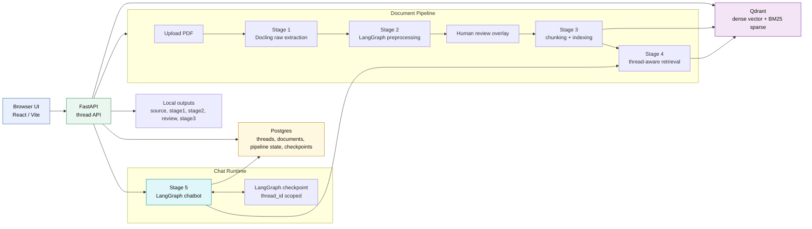
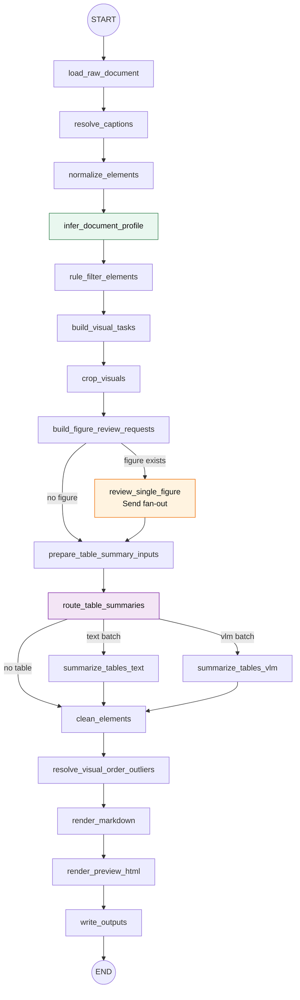
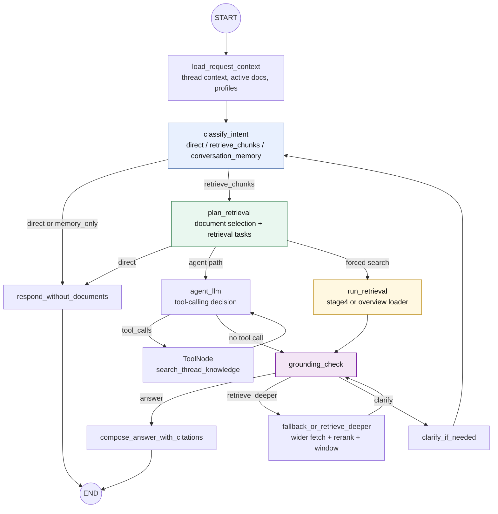

# Doc Chat RAG Pipeline

PDF를 `Docling -> LangGraph preprocessing -> chunking/indexing -> retrieval -> LangGraph chatbot` 흐름으로 처리하는 로컬 RAG 실험/프로토타입입니다.

현재 앱의 최상위 작업 단위는 `thread_id`입니다. 문서 업로드, 검수, 인덱싱, 검색, 채팅 기록, LangGraph checkpoint가 모두 thread 범위로 묶입니다.

## 현재 상태

2026-04-25 기준 구현된 범위입니다.

- 백엔드: FastAPI
- 프론트: React + Vite + TypeScript
- DB: Postgres `app_chat`, `app_doc`, `app_pipeline`, `app_checkpoint`
- Vector DB: Qdrant hybrid-ready collection
- 파싱: Docling 기반 PDF element extraction
- 전처리: LangGraph 기반 caption 연결, visual crop, figure/table summary, document profile 생성
- 검수: stage2 결과에 대한 drop/restore overlay
- 인덱싱: 구조 기반 chunking, parent grouping, dense embedding, BM25 sparse payload upsert
- 검색: dense/hybrid retrieval, document filter, per-document retrieval, cross-encoder rerank 옵션, context window 확장
- 챗봇: LangGraph stage5 graph, tool-calling, grounded answer, conversation memory, evidence/debug trace
- UI: thread sidebar, document upload/review/chat, evidence chunk/visual asset/debug trace 확장 패널

최근 검증:

```bash
LANGSMITH_TRACING=false LANGCHAIN_TRACING_V2=false \
  ./.venv/bin/python -m unittest \
  tests.test_stage4_retrieval \
  tests.test_chat_service \
  tests.test_stage5_chatbot
```

결과: `57 tests OK`

## 전체 아키텍처



### 핵심 데이터 흐름

1. 사용자가 thread를 만들고 PDF를 업로드합니다.
2. `stage1`이 PDF를 element JSON으로 분해합니다.
3. `stage2`가 caption/visual/profile을 보강하고 `cleaned.json`을 만듭니다.
4. 사용자는 review 화면에서 drop/restore 결정을 저장합니다.
5. finalize 시 `reviewed_cleaned.json` 기준으로 `stage3`가 chunk와 parent를 만들고 Qdrant에 upsert합니다.
6. chat 요청은 `thread_id` 기준으로 active documents와 document profile을 읽고, stage5 LangGraph가 검색/답변을 수행합니다.

## 로컬 실행

### 백엔드

```bash
python -m venv .venv
source .venv/bin/activate
pip install -r requirements.txt

LANGSMITH_TRACING=false LANGCHAIN_TRACING_V2=false \
  ./.venv/bin/uvicorn backend.api.main:app --reload --host 127.0.0.1 --port 8000
```

### 프론트

```bash
cd frontend
npm install
npm run dev
```

브라우저에서 `http://127.0.0.1:5173` 또는 `http://localhost:5173`을 엽니다.

## 주요 라우트

- `/`: thread 목록, 새 thread 생성, 첫 문서 업로드
- `/threads/:threadId/documents/:documentId/review`: stage2 검수
- `/threads/:threadId/chat`: thread 단위 문서 채팅

주요 API:

- `GET /threads`
- `POST /threads`
- `DELETE /threads/{thread_id}`
- `GET /threads/{thread_id}/documents`
- `POST /threads/{thread_id}/documents/upload`
- `POST /threads/{thread_id}/documents/process-upload`
- `POST /threads/{thread_id}/documents/{document_id}/prepare-review`
- `POST /threads/{thread_id}/documents/{document_id}/finalize-review`
- `GET /threads/{thread_id}/chat`
- `POST /threads/{thread_id}/chat`

## 산출물 구조

문서 하나는 `backend/outputs/<document_id>/` 아래에 저장됩니다.

```text
backend/outputs/<document_id>/
├── source/
│   ├── original.pdf
│   └── document.json
├── stage1/
│   └── raw.json
├── stage2/
│   ├── cleaned.json
│   ├── cleaned.md
│   ├── preview.html
│   ├── figures/
│   └── tables/
├── review/
│   ├── review_decisions.json
│   ├── reviewed_cleaned.json
│   ├── reviewed_cleaned.md
│   └── reviewed_preview.html
├── stage3/
│   ├── chunks.json
│   ├── chunks.jsonl
│   ├── chunks.md
│   ├── parents.json
│   └── indexing.json
└── stage4/
    └── retrieval.json
```

원칙:

- `stage2/cleaned.json`은 자동 전처리 결과입니다.
- 사용자 검수 결정은 `review/review_decisions.json`에 overlay로 저장합니다.
- `stage3`는 `reviewed_cleaned.json`이 있으면 그 파일을 우선 사용합니다.
- Qdrant에는 검색에 필요한 최소 payload를 저장하고, 상세 provenance는 local/Postgres metadata에서 복원합니다.

## Stage별 역할

### Stage 1: Docling raw extraction

담당 파일:

- `backend/stage1.py`
- `backend/stage1_parse/`

역할:

- PDF를 Docling으로 파싱합니다.
- `heading`, `paragraph`, `list`, `table`, `figure`, `caption` 등 element list를 만듭니다.
- page, bbox, caption ref, table markdown, picture label 같은 구조 정보를 보존합니다.

### Stage 2: LangGraph preprocessing

담당 파일:

- `backend/stage2.py`
- `backend/stage2_preprocess/graph.py`
- `backend/stage2_preprocess/nodes.py`

그래프:



운영 원칙:

- 본문 텍스트는 stage2에서 공격적으로 삭제하지 않습니다.
- figure/table의 원본 crop을 보존합니다.
- `document_profile`은 visual relevance 판단과 stage5 문서 선택 힌트로 사용합니다.
- table은 HTML만으로 충분하면 텍스트 모델, 이미지가 필요하면 VLM 경로를 탑니다.
- 모델 호출 노드는 LangGraph retry policy를 사용합니다.

### Stage 3: chunking + indexing

담당 파일:

- `backend/stage3.py`
- `backend/stage3_chunking/`
- `backend/stage3_indexing/`

역할:

- `cleaned.json` 또는 `reviewed_cleaned.json`을 읽습니다.
- `heading_path`를 유지해 `text`, `table`, `figure` chunk를 만듭니다.
- 긴 prose run만 hard split하고, split된 sibling에만 제한적으로 overlap을 둡니다.
- `parents.json`으로 child chunk의 상위 문맥 boundary를 만듭니다.
- Qdrant에는 dense vector와 BM25 sparse vector를 함께 올릴 수 있는 hybrid-ready point를 저장합니다.
- collection 이름은 DB 저장값이 아니라 `thread_id -> collection_name` 규칙으로 계산합니다.

### Stage 4: thread-aware retrieval

담당 파일:

- `backend/stage4.py`
- `backend/stage4_retrieval/`

역할:

- `thread_id`, `active_document_ids`, `document_id` filter를 Qdrant 검색에 적용합니다.
- `dense` 또는 `hybrid` 모드로 검색합니다.
- 여러 문서가 대상이면 문서별 독립 검색을 수행한 뒤 후보를 병합할 수 있습니다.
- 필요 시 cross-encoder rerank와 MMR 후처리를 적용합니다.
- child hit 이후 `window` 또는 `parent` context 확장을 수행합니다.

기본 정책:

- 코드 기본값은 `dense`입니다.
- Qdrant collection은 hybrid-ready로 올립니다.
- 정확 키워드, 함수명, 표/그림 번호, 절차/수치 질의는 stage5 planning에서 `hybrid`를 선택할 수 있습니다.
- 다중 문서 검색은 `top_k`를 문서 수에 따라 늘리고 rerank를 적용합니다.

### Stage 5: LangGraph chatbot

담당 파일:

- `backend/stage5.py`
- `backend/stage5_chatbot/graph.py`
- `backend/stage5_chatbot/nodes.py`
- `backend/stage5_chatbot/models.py`
- `backend/stage5_chatbot/prompts.py`

그래프:



Stage5의 현재 운영 원칙:

- `classify_intent`는 큰 방향만 정합니다.
- `plan_retrieval`은 문서 프로파일을 보고 대상 문서와 retrieval task를 설계합니다.
- 프로파일만으로 문서 내용을 답하지 않습니다.
- 문서 요약/개요 질문은 `document_overview` 전략으로 Postgres 대표 본문 블록을 가져옵니다.
- 특정 함수/표/그림/페이지/절차/수치 질문은 청크 검색을 수행합니다.
- 문서명/제목이 명시된 다중 질문은 하위 task별로 문서에 배치합니다.
- 문서명이 없는 다중/광역 질문은 프로파일 추정으로 특정 문서에 강제 배치하지 않고, active documents 전체를 균형 검색합니다.
- 검색 결과가 부족할 때만 `retrieve_deeper` 또는 `clarify`로 갑니다.
- 이전 대화 회상 질문은 `conversation_memory`로 처리합니다.
- assistant 메시지에는 citation, evidence chunks, visual assets, debug trace를 함께 저장합니다.

## Stage5 structured output

현재 stage5에서 중요한 구조화 출력은 아래와 같습니다.

### `IntentClassificationResult`

- `answer_strategy`: `direct`, `retrieve_chunks`, `conversation_memory`
- `memory_mode`: `none`, `memory_only`, `resolve_for_retrieval`
- `reason`

### `DocumentSelectionResult`

- `query_type`: `single_document`, `multi_document`, `comparison`, `thread_wide`, `conversation_memory`, `open_domain`
- `selected_document_ids`
- `retrieval_tasks`
- `retrieval_mode`: `dense` 또는 `hybrid`
- `answer_strategy`

### `RetrievalTask`

- `task_id`
- `subquery`
- `user_question`
- `search_query`
- `task_type`: `fact_lookup`, `exact_keyword`, `document_summary`, `comparison`, `procedure`, `figure_table`, `conversation_memory`, `general`
- `retrieval_strategy`: `vector_search`, `hybrid_search`, `document_overview`, `balanced_multi_document`, `asset_lookup`, `conversation_only`, `no_retrieval`
- `document_ids`

## 검색 정책 요약

현재 RAG 품질 튜닝의 핵심 방향입니다.

- 문서 프로파일은 routing/planning 힌트로만 사용합니다.
- 검색 query에는 프로파일 제목/토픽/키워드를 자동으로 덧붙이지 않습니다.
- 문서명 없는 다중 질문은 전체 active documents를 균형 검색합니다.
- 문서명/제목이 명시된 다중 질문은 task별 문서 검색을 수행합니다.
- 요약/개요 질문은 일반 vector top-k만 쓰지 않고 대표 본문 블록을 가져옵니다.
- exact keyword/identifier/table/figure/page 질문은 hybrid를 우선 고려합니다.
- 다중 문서 검색은 후보를 넓게 가져온 뒤 rerank로 압축합니다.
- grounding check가 부족하다고 판단하면 fetch를 넓혀 추가 검색합니다.

## 프로젝트 구조

```text
backend/
├── api/                       # FastAPI app and routes
├── app_db/                    # Postgres DDL, repositories, runtime services
├── common/                    # shared helpers
├── document_store/            # output directory metadata management
├── review_overlay/            # review decision overlay
├── services/                  # thread, pipeline, chat service layer
├── stage1_parse/              # Docling extraction
├── stage2_preprocess/         # LangGraph preprocessing graph
├── stage3_chunking/           # structure-first chunking
├── stage3_indexing/           # Qdrant indexing
├── stage4_retrieval/          # retrieval, rerank, context expansion
└── stage5_chatbot/            # LangGraph chatbot

frontend/
├── src/pages/                 # Documents, Review, Chat
├── src/components/            # trace, preview, sidebar components
└── src/lib/                   # API client and UI helpers

tests/
├── test_stage2_preprocess.py
├── test_stage3_chunking.py
├── test_stage4_retrieval.py
├── test_chat_service.py
└── test_stage5_chatbot.py
```

## 테스트

전체 테스트:

```bash
.venv/bin/python -m unittest discover -s tests -v
```

최근 stage4/stage5 관련 빠른 검증:

```bash
LANGSMITH_TRACING=false LANGCHAIN_TRACING_V2=false \
  ./.venv/bin/python -m unittest \
  tests.test_stage4_retrieval \
  tests.test_chat_service \
  tests.test_stage5_chatbot
```

프론트 빌드:

```bash
cd frontend
npm run build
```

## 환경 변수

주요 값만 정리합니다. 자세한 기본값은 각 `config.py`를 확인하세요.

```bash
OPENAI_API_KEY=...
OPENAI_TEXT_MODEL=openai:gpt-4.1-nano
OPENAI_VLM_MODEL=openai:gpt-4o-mini

STAGE3_EMBEDDING_BASE_URL=http://localhost:11434/v1
STAGE3_EMBEDDING_API_KEY=ollama
STAGE3_EMBEDDING_MODEL=bge-m3
STAGE3_ENABLE_INDEXING=true
STAGE3_QDRANT_URL=http://127.0.0.1:6333
STAGE3_QDRANT_COLLECTION_NAME=rag_chat_hybrid

STAGE4_RETRIEVAL_MODE=dense
STAGE4_TOP_K=8
STAGE4_FETCH_K=20
STAGE4_ENABLE_RERANK=false
STAGE4_PARENT_EXPAND_MODE=window

STAGE5_AGENT_MODEL=openai:gpt-4.1-mini
STAGE5_DEFAULT_RETRIEVAL_MODE=dense
STAGE5_CHECKPOINTER_BACKEND=postgres
STAGE5_POSTGRES_URI=...

LANGSMITH_TRACING=false
LANGCHAIN_TRACING_V2=false
```

## 현재 남은 작업

- stage5 다중 문서 검색 품질을 계속 평가하고 케이스별 실패 원인을 축적
- document overview 대표 블록 선택 방식 개선
- rerank 모델 지연/메모리 비용 줄이기
- stage3/stage4 오래된 room 기준 테스트 잔재 정리
- OCR Docker 레이어와 이미지 PDF 자동 라우팅
- frontend trace UI에서 overview/search/rerank/window 정보를 더 명확히 구분
- 전체 E2E 시나리오 자동화
